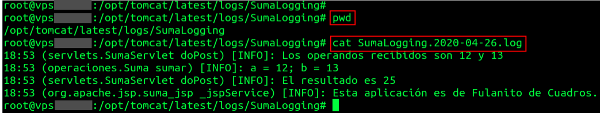

**Actividad 1.** Crea un proyecto que calcule el enésimo término de la serie de Fibonacci. El proyecto incluirá los siguientes elementos:
- Un documento HTML con un formulario que admite un número. Este número representa el enésimo término de la serie, y es enviado mediente el método POST a un servlet.
- Un servlet, cuyo nombre de despliegue es *fibonacci*. 
- Una clase llamada *Fibonacci* que calcula el enésimo término de la serie.
- Un documento JSP que muestra el resultado en forma de documento HTML.

Elige cómo quieres declarar el servlet, mediante el DD, o bien mediante anotaciones.


**Actividad 2.** Crea una aplicación web que contenga los siguientes archivos.

Maximo.java

- Contiene el método int maximo(List<Integer> numeros), que devuelve el máximo de una lista de números.
      
numeros.html

- Contiene 3 inputs de tipo number y un botón de envío. 
- En cada input se escibe un número.
- Al hacer clic en el botón, se envía una solicitud AJAX (método POST) al servlet NumerosServlet.
- La solicitud AJAX envía una cadena JSON con los tres números.
- El resultado de la consulta es una cadena JSON que contiene los tres números y el máximo de dichos números.
- Suponiendo que los números enviados son 1, 6 y 3, el contenido del JSON es mostrado en un párrafo debajo de los inputs mediante el siguiente texto:

> El máximo de los números 1, 6 y 3 es 6
      
NumerosServlet.java

1. Obtiene la cadena JSON y extrae los tres numeros de los inputs. 
2. Crea un objeto de tipo Maximo.
3. Los tres números son pasados mediante en un ArrayList al método maximo del objeto de tipo Maximo.
4. Los tres números y el máximo calculado son devueltos como una cadena JSON a numeros.html

**Actividad 3.** Escribe una aplicación siguiendo el patrón MVC, usando una página frontal html (llamada *suma.html*) con un formulario que tome dos números, un servlet (llamado *SumaServlet*) y un archivo JSP (llamado *suma.jsp*). Además, crea una clase llamada *Suma* que sume dos números. Configura el proyecto para escribir logs como los siguientes:



Ten en cuenta las siguientes cuestiones:

- El archivo de logs debe ubicarse en una carpeta dedicada para el proyecto. Por ejemplo, en la captura los logs están en la carpeta */opt/tomcat/latest/logs/SumaLogging*. El contenido del archivo de logs generado debe tener una estructura similar a la mostrada:

```
18:53 (servlets.SumaServlet doPost) [INFO]: El resultado es 25

hora (origen del log) [severidad]: mensaje
```

- El último log, realizado desde el archivo JSP debe contener tu nombre.

- El comando *pwd* muestra tu ubicación en el sistema de archivos. Ejecútalo para poder comprobar en qué punto está el archivo de Logs.

- El comando *cat* muestra el contenido de un archivo. Muestra el contenido del archivo de logs.

Toma una captura similar a la mostrada, donde se pueda ver:

1. El resultado de ejecutar el comando *pwd*.
2. El resultado de ejecutar el comando *cat* sobre el archivo de logs.
3. Tu nombre en el último log, realizado desde el archivo JSP.

**Actividad 4.** El objetivo de este ejercicio es crear una *cookie* desde el servidor. En este caso, la *cookie* es el código hexadecimal de un color.

Crea una aplicación que permita elegir un color de fondo de página. Para ello, utiliza el siguiente fragmento de código html:

```
<!DOCTYPE html>
<html lang="en">
<head>
    <meta charset="UTF-8">
    <title>Color</title>
</head>
<body>
    <p>Elige un color de fondo</p>
    <form>
        <input type="color" id="color" name="color"/>
        <button id="enviar_color">Enviar</button>
    </form>
</body>
</html>
```
Cuando elijas el color, éste debe ser enviado a un servlet, llamado *CookieColorServlet*, en una cadena JSON como la siguiente:

    {"color":"#13763c"}

Siendo *#13763c* el color elegido.

El servlet *ColorServlet* creará una *cookie* llamada *color*, con el color elegido, y devolverá una cadena JSON similar a la siguiente:

    {"status":"ok","color":"#13763c"}

Cuando el documento html recibe la cadena JSON, cambia aplica el color elegido al fondo de la página. Para ello, puedes utilizar las siguientes líneas de código:

```
    let body = document.getElementsByTagName("BODY")[0];
    body.style.backgroundColor = jsonRecibido.color;
```

Debes además comprobar que se ha creado la *cookie* correspondiente en el navegador (a través de las herramientas para programadores).

-------------------------------------
**Actividad 5.** En el ejercicio anterior, creaste una *cookie*, pero ahora el objetivo no es crearla, sino leerla. Es decir, si existe, comprobar el valor que tiene, y hacer algo con ese valor.

Imagina que en el ejercicio anterior, cierrras el navegador, y lo vuelves a abrir. A priori, el fondo de página es blanco. Pero si existe una *cookie* creada anteriormente, podrías leerla, y decirle al navegador que cambie el color de fondo de *body*. ¿Cómo se puede hacer esto? Utilizando el evento *onload*:

```
 window.addEventListener("load",function(e){
    // Todo lo que metas aquí se ejecuta al cargar la página
 }
```
Cuando se carge la página, deberás consultar a un servlet llamado *ColorElegidoServlet*, que devolverá lo siguiente al lado cliente:

- En caso de que la *cookie* exista, obtiene su valor, y lo devuelve en una cadena JSON como la siguiente:

    {"status":"ok","color":"#13763c"} // suponiendo que #13763c es el color almacenado en la cookie

- En caso de que la *cookie* no exista, devuelve una cadena JSON como la siguiente:

    {"status":"ko"}

Cuando el lado cliente recibe la cadena JSON, actúa sobre el fondo en caso de que *status* sea *ok*.

Adjunto un vídeo con el comportamiento del ejercicio: [Vídeo](recursos/act2_cookies.mp4)

---------------------------------------------------

**Actividad 6**. Crea una aplicación que permite añadir nombres de personas y su edad en una lista. Utiliza *HttpSession* para guardar los datos de las personas añadidas. Mientras la sesión esté activa, ve guardando los datos en ella. 

Los datos de las personas añadidas deben mostrarse en una lista por pantalla. 

Debes tener en cuenta que:
- Existe una clase llamada *Persona* que contiene la información relativa a una persona.
- Los datos de cada *Persona* se deben guardar en un *ArrayList* en el servidor.
- Cuando abras el navegador, deben mostrarse desde el primer momento los nombres de las personas añadidas.

Adjunto un vídeo con el comportamiento del ejercicio: [Vídeo](recursos/act3_sesiones.mp4)