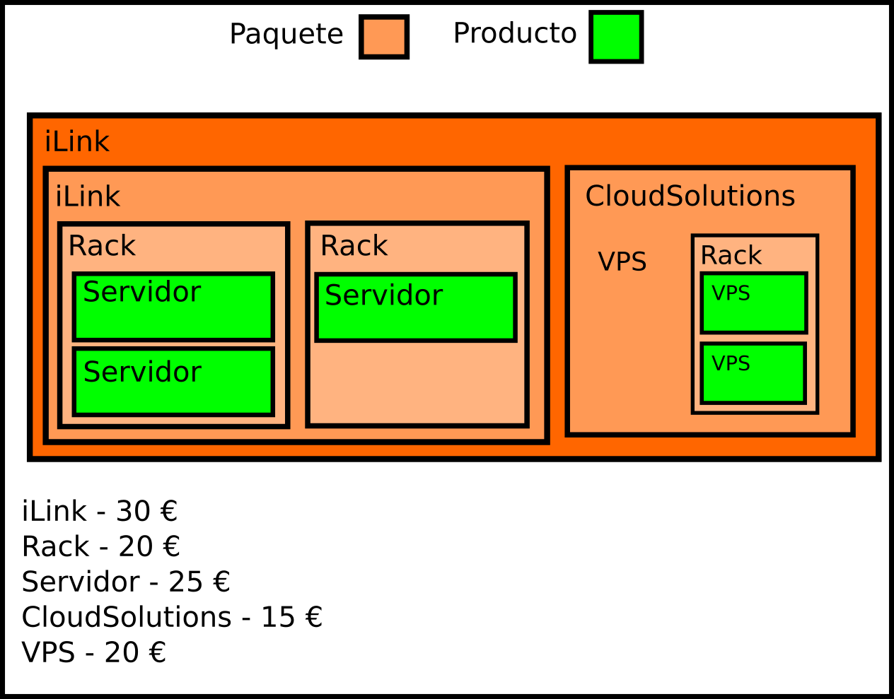

# Actividades de patrones de diseño

**Actividad 1.** (Sacada del baúl de los recuerdos) Supongamos que contamos con una lista de productos. Cada producto tiene un nombre, un precio y un índice de valoración que puede ir de 0 a 5. Los productos se pueden gestionar dentro de una clase llamada LoteDeProductos, que implementa los métodos siguientes:

    int getTotalProductos()
    Producto getProductoEnPosicion(int i)
    void addProducto(Producto producto))

Imagina que deseas obtener un mejor producto de la lista (Seller's Choice). Existen tres criterios para elegir el mejor producto:

    El mejor valorado.
    El más barato.
    Aquel que tenga mejor relación valoración/precio.

> NOTA: Puede que en el futuro se propongan otros criterios de elección.

Existe una interfaz llamada SelectorDeMejorProducto que incluye el siguiente método:

    LoteDeProductos elegirMejoresProductos()

Resuelve el ejercicio utilizando uno de los patrones anteriores.

**Actividad 2** (Sacada del baúl de los recuerdos). Contamos con un sensor que obtiene la temperatura de una cámara de combustión. Cada vez que se produce un cambio de temperatura, hay una serie de artefactos que reciben las nuevas actualizaciones de temperatura y utilizan esta información para procesarla de manera diferente. Por ejemplo:

- Diario de temperaturas. Podemos ver la temperatura a lo largo de las horas del día.
- Promedio de temperatura. Realiza un promedio de la temperatura a lo largo del día.
- Registro de temperaturas críticas. Almacena las horas a las que se superó un umbral de temperatura crítica.

No se descarta que se requieran nuevos artefactos.

Construir un programa que resuelva el problema. Para ello, utilizar las siguientes interfaces:

**ConsumidorDeTemperaturas**
- setNuevaTemperatura(temperatura,hora)
        
**FuenteDeTemperaturas**
- registrarConsumidor(ConsumidorDeTemperaturas)
- informarAConsumidores()

A continuación agrego un fragmento de código que puedes utilizar como punto de partida para simular las lecturas de temperatura. Si ejecutas este código, verás que se producen lecturas de temperatura aleatorias en periodos múltipos de 5 segundos. 

[Ayuda actividad observer](recursos/ayuda_actividad_observer.zip)

**Actividad 1**. Deseas poder mostrar información de texto por consola usando diferentes formatos. Para ello, cuentas con las siguientes clases:

- **TextDataViewer** - muestra el contenido de los objetos mediante texto plano.
- **HTMLDataViewer** - muestra el contenido de los objetos mediante código html.

Los datos que necesitas mostrar están en el archivo [poblacion-por-nacionalidades_2016-2018.xml](recursos/poblacion-por-nacionalidades_2016-2018_alcobendas.xml). 

Para saber cómo mostrar la información, utilizarás un archivo de configuración llamado *.env* que incluye un parámetro llamado *viewer*. Por ejemplo si la impresión debe ser en html, *.env* contendrá:

```
viewer=html
```
en caso de querer mostrarlo en formato de texto, *.env* contendrá:
```
viewer=text
```
#### Cómo debe verse:
Supongamos la línea siguiente del archivo *poblacion-por-nacionalidades_2016-2018.xml*
```
<row Año="2016" Nacionalidad="Afganistán" Número_de_empadronados="9"></row>
```
El resultado en html debe ser como sigue:
```
<table>
    <tr>
        <th>Nacionalidad</th><th>Año</th><th>Total</th>
    </tr>
    
    ...
    
    <tr>
        <td>Afganistán</td><td>2016</td><td>9</td>
    </tr>
    
    ...
    
</table>
```
El resultado en texto debe ser como sigue:
```
Listado de empadronamientos:
    ...
    
    El total de empadronados en 2016 procedentes de Afganistán fue de 9 personas.
    
    ...
```
Aplica el patrón *Factory Method* para crear un proyecto que resuelva el problema. La información que debes mostrar por pantalla es la siguente: [poblacion-por-nacionalidades_2016-2018.xml](recursos/poblacion-por-nacionalidades_2016-2018_alcobendas.xml)

------------------------

**Actividad 2**. En un juego hay diferentes escenarios posibles, y personajes acordes al escenario. En concreto, las posibilidades son las siguientes:

Escenario    | Jugador        | Villano | Obstáculos 
-------------|----------------|---------|------------------
**Selva**    | Indiana        | Molaram | Carcelero turco
**Desierto** | Patton         | Rommel  | Tanques
**Espacio**  | USS Enterprise | Khan    | Naves Klingon 

Dependiendo del Escenario elegido por el jugador, se crearán diferentes elementos para el juego. Es preciso que se traten de clases diferentes, puesto tendrán comportamientos diferentes. 

Escribe una clase llamada *SelectorJuego* que da al jugador la opción de elegir uno u otro escenario. Dependiendo de la elección, crea los elementos del juego necesarios.

-------------------

**Actividad 3**. Escribe un programa que cree un plan de actividades durante la estancia en un hotel de vacaciones. Existen varios servicios a los que un cliente puede acceder:

- Desayuno
- Almuerzo
- Cena
- Habitación simple, doble o suite
- Cama adicional
- Parque de atracciones
- Curso de kite surf
- Actividades infantiles
- Cine en la playa

Estos servicios se pueden contratar en packs, a saber:

- Pack básico (habitación simple y desayuno)
- Pack romance (habitación doble y cena)
- Pack familiar (habitación doble, cama adicional, desayuno, almuerzo, cena, parque de atracciones, actividades infantiles y cine en la playa)
- Pack padres relajados (habitación doble, cama adicional, desayuno, almuerzo, cena, actividades infantiles, curso de kite surf y cine en la playa)
- Pack deluxe (suite, desayuno, almuerzo y cena, curso de kite surf y cine en la playa)
- Pack deluxe familiar(suite, cama adicional, desayuno, almuerzo, cena, parque de atracciones, curso de kite surf, actividades infantiles y cine en la playa)

Escribe un programa que pregunte al cliente qué pack desea contratar, y que construya el plan deseado mediante el patrón builder.

----------------------

**Actividad 4**. Observa el siguiente diagrama:


Escribe un proyecto que incluya las tres clases del diagrama, descritas a continuación:

- *Tareas* implementa el patrón Singleton.      
    - *tareas* contiene una lista de cadenas de texto que representan tareas que deben ser realizadas.  
    - *últimaRealizada* con la posición de la última tarea realizada en la lista.
    - *addTarea* permite añadir una nueva cadena de texto a la lista de tareas.
    - *getÚltimaTareaRealizada* devuelve la cadena de texto de la lista en la posición *últimaTareaRealizada*.
    - *cambiarÚltimaTareaRealizada* toma un valor positivo o negativo como parámetro y modifica el atributo *últimaTareaRealizada*.
- *AvanceTarea* es una clase cliente de *Tareas*:
    - *avanzar* toma un número positivo, e incrementa *últimaTareaRealizada*.
    - *mostrarÚltimaTareaRealizada* devuelve la cadena de texto correspondiente a la última tarea realizada.
- *RetrocesoTarea* es una clase cliente de *Tareas*:
    - *retroceder* toma un número positivo, y decrementa *últimaTareaRealizada*.
    - *mostrarÚltimaTareaRealizada* devuelve la cadena de texto correspondiente a la última tarea realizada.

Escribe un programa que haga lo siguiente:

1. Insertar un conjunto de tareas en la clase *Tareas*.
2. Realiza varios avances y retrocesos en las tareas.
3. Cada vez que realices un avance o un retroces, muestra la última tarea realizada.
4. Antes de terminar, muestra la última tarea realizada y comprueba que la información es coherente con los avances y retrocesos realizados durante la ejecución.

NOTA: Toma las decisiones que consideres oportunas en cuanto a manejo de errores (como un índice de lista fuera de rango).

Actividad 1. En Swing, JTable permite mostrar objetos de forma tabulada. Hasta ahora hemos manejado las tablas usando un adaptador predefinido: *DefaultTableModel*. En este ejercicio vamos a crear nosotros nuestro propio adaptador, lo que ofrece más posibilidades.

El problema planteado es el siguiente: Existe una clase llamada *Persona* con los siguientes campos:

- *String nombre*
- *String apellidos*
- *int edad*

Por otra parte, contamos con una ventana como la siguiente:


Se desea implementar un adaptador para que el comportamiento de la tabla sea el mostrado en el siguiente vídeo:

[Vídeo explicativo del ejercicio del patrón adaptador](recursos/img/ad5.mp4)

Inicialmente existe una lista de personas. Los nombres de dichas personas pueden ser los mostrados en el vídeo u otros diferentes.

Para saber cómo funciona *AbstractTableModel*, te propongo el siguiente recurso:

1. [Documentación de Oracle sobre AbstractTableModel](recursos/https://docs.oracle.com/javase/7/docs/api/javax/swing/table/AbstractTableModel.html)

--------------------------

Actividad 2. Supongamos que una empresa vende servicios con las siguientes características:
- Un servicio tiene un nombre y un precio. 
- Alungos tipos de servicio se pueden componer a su vez de más servicios, a lo que se le llama *paquete*.
- Algunos tipos de servicio son llamados *productos*, y no se pueden componer de más servicios.

Se desea poder almacenar esta información, y poder realizar las siguientes consultas sobre un servicio:

- *añadir un servicio* (sólo es posible en el caso de un paquete)
- *eliminar un servicio* (sólo es posible en el caso de un paquete)
- *asignar el precio a un servicio* (en el caso de un paquete, el precio corresponde a la tasa por el paquete, aparte de los productos contratados).
- *obtener el precio de un servicio* (en el caso de un paquete, el precio corresponde al precio total del servicio, incluyendo la tasa por paquete y los productos contratados) 

La siguiente imagen muestra un ejemplo paquete contratado por un cliente:



Desarrolla un proyecto en el que puedas construir paquetes de servicios, y calcular su coste. Como prueba de funcionamiento, construye el paquete de servicios mostrado en la imagen, y calcula el coste de:

- rack1 
- ilink1.1
- ilink1
- cloud
