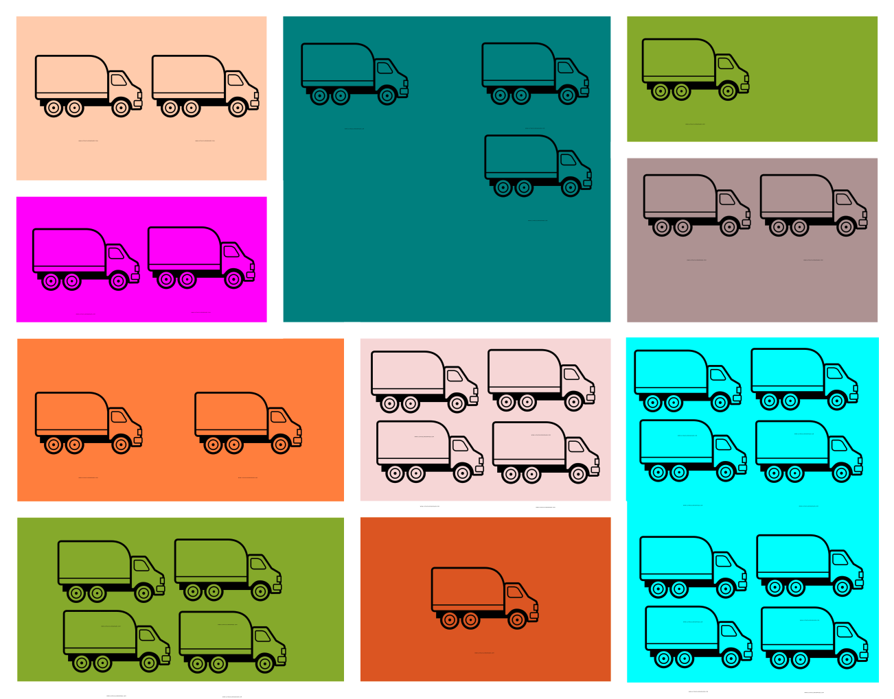
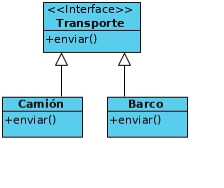
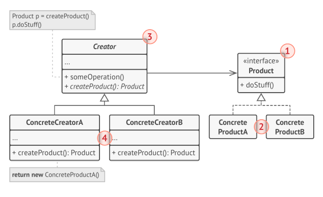
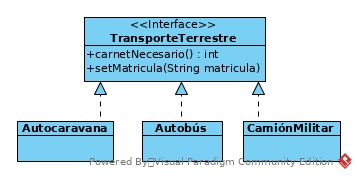
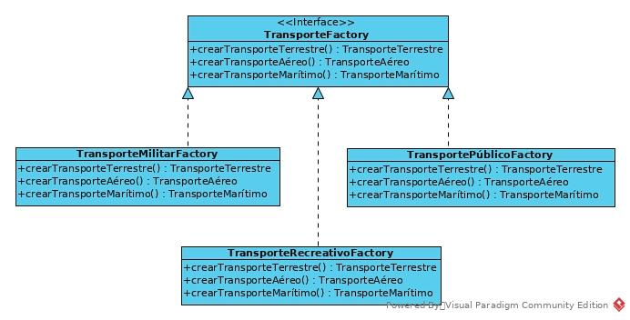
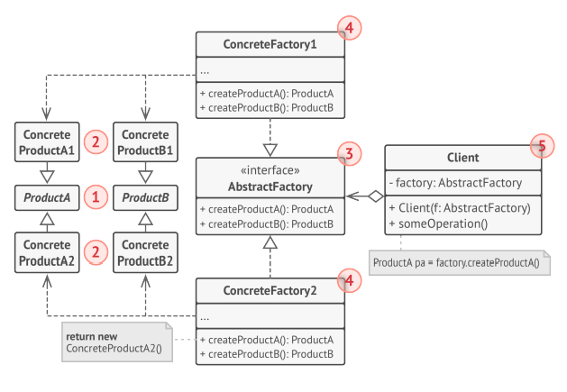

# Patrones de diseño

Existen tres tipos generales de patrones de diseño:
- Patrones creacionales.
- Patrones estructurales.
- Patrones de comportamiento.

Vamos a ir viendo tipos de cada uno, y finalmente, veremos el *rey de los patrones*, MVC, por ser una composición de varios tipo de patrón.

La lista de patrones es amplia, y sólo veremos algunos de ellos. La lista "oficial" de patrones es la siguiente:

- **Patrones creacionales:**
    - Factory Method
    - Astract Factory
    - Builder
    - Singleton
    - Prototype
- **Patrones estructurales:**
    - Adapter
    - Bridge
    - Composite
    - Decorator
    - Facade
    - Flyweight
    - Proxy
- **Patrones de comportamiento:**
    - Chain of Responsibility
    - Command
    - Iterator
    - Mediator
    - Memento
    - Observer
    - State
    - Strategy
    - Template Method
    - Visitor

> Esta lista es una propuesta del libro *Design Pattern, Elements of Reusable Object-Oriented Software* escrito por Erich Gamma, Richard Helm, Ralph Johnson, y John Vlissides, que fue el libro que popularizó el concepto de *patrón de diseño*.

## Patrones creacionales

> Los patrones creacionales proporcionan mecanismos para crear objetos, buscando incrementar la flexibilidad y la reusabilidad del código.

# Patrón número 1. Factory Method

Imaginemos que estamos creando una aplicación de gestión logística. La primera versión de la aplicación sólo trabaja con transportes en camión, de forma que en el código aparece la clase **Camión**. 
Supongamos que la aplicación se hace popular, y se reciben peticiones de compañías de transporte marítimo que desean que la logística marítima se meta también en la aplicación. Inicialmente, nuestra aplicación tiene el siguiente aspecto:


*Ilustracción artística de la apliación.*

Ahora mismo, el código estrá repleto de objetos *Camión* por todas partes. Para añadir los barcos, tendremos en primer lugar que crear una interfaz común para nuestros medios de transporte:



Suponiendo que esto es todo lo que hacemos, tendremos que modificar el código, allí donde aparezca la clase *Camión*, para añadir la clase *Barco*, terminando con fragmentos como el siguiente:

```
    Transporte t;
    if (tipoTransporte == Transporte.CAMION){
        t = new Camion();
    } else if (tipoTransporte == Transporte.BARCO){
        t = new Barco();
    }
```
Conforme vayan apareciendo nuevos medios de transporte, tendremos que volver a modificar el código, añadiendo el nuevo medio de transporte a lo largo de la aplicación.

## Solución. 

El patrón **Factory Method** sugiere que en lugar de crear directamente los objetos, los objetos sean creados por un método *factory* específico



1. **Product** declara la interfaz, que es común a todos los objetos que pueden ser creados y sus subclases.
2. **Concrete Products** son implementaciones diferentes de la interfaz *Product* (en nuestro caso, *Camión*, *Barco*, etc.).
3. **Creator** declara el método *factory* que devuelve el nuevo producto. Es importante que el tipo devuelto por este método sea de tipo *Product*. Se puede declarar el método *factory* como abstracto en la case base (*Creator*), para forzar a todas las subclases a implementar sus propias versiones del método. Como alternativa, la clase base puede devolver algún tipo *Product* por defecto.
4. **Concrete Creators** sobreescribe el método *factory*, de forma que devuelve diferentes tipos de producto.

> ¡OJO! Un *factory method* no tiene por qué crear nuevas instancias todo el rato. Puede también devolver objetos de una caché, una lista de objetos, etc.

## Ejemplo

Puedes ver un ejemplo en [src/Patrones_diseño.zip](https://github.com/MauricioMatamala/Programacion/blob/master/Patrones%20de%20dise%C3%B1o/src/patrones_dise%C3%B1o.zip)

## Cuándo aplicar el patrón *Factory method*

- Cuando no sepamos de antemano los tipos exactos de objetos con los que tendrá que trabajar el código. Con este patrón separamos la construcción de un objeto de su uso. 
- Cuando queramos proporcionar a los usuarios de nuestro código una forma de extender los componentes internos.
- Cuando queramos ahorra recursos de cómputo, reutilizando objetos que ya han sido creados anteriormente. Para reutilizar un objeto ya creado anteriormente:
    1. Debemos contar con un depósito donde almacenar los objetos creados (podría ser un objeto de clase *List*, por ejemplo).
    2. Cuando nos solicitan un objeto, el programa puede buscar un objeto libre en dicho depósito. Si existe dicho objeto, devolverlo.
    3. Si no hay objetos libres, se puede crear uno

## Ventajas e inconvenientes

- Minimizamos el acoplamiento entre las clases cliente y sus dependencias.
- Garantizamos el principio SRP, ya que quitamos la responsabilidad de crear el producto adecuado a la clase cliente.
- Garantizamos OCP. Se pueden introducir nuevas clases de producto sin romper el código existente.
- El código se vuelve más complicado.

# Abstract Factory

Supongamos que estamos trabajando con varias categorías de vehículos, descritos mediante la siguiente imagen:


Necesitamos un sistema para crear vehículos individuales de forma que estén en consonancia con los otros objetos de la misma familia. Por ejemplo, si un cuerpo militar solicita un avión y un barco, éstos deberían ser de categoría militar.

También queremo evitar tener que cambiar el código cada vez que se añadan nuevos productos a la familia de productos. Imaginemos que agregamos también la categoría *futurístico* y *victoriano*.

## Solución 

Para empezar, el patrón *Abstract Factory* recomienda crear interfaces para cada producto distinto de cada familia (Barco, Autobús, Avión, etc.). Por ejemplo, en el caso del autobús:



El siguiente paso es crear una interfaz *Abstract Factory* con la lista de métodos de creación para todos los tipos de producto de una misma familia (por ejemplo, *crearTransporteTerrestre*, *crearTranporteAéreo* y *crearTransporteMarítimo*).

Finalmente, habrá que crear una implementación concreta de la interfaz *Abstract Factory* para cada familia de productos, en nuestro caso, militar, recreativo y público. De este modo, nuestro ejemplo quedaría así:



Supongamos que una clase cliente desea producir un vehículo terrestre. Es deseable que dicha clase no tenga que saber los datalles sobre si el vehículo debe ser militar o público. Además, debe tratar a todos los vehículos terrestres de la misma manera, sin preocuparle si se trata de un autobús, un camión militar o una autocaravana.

Entonces, ¿Quién crea las factorías concretas? El cliente no debe tener que saber qué tipo de *astract factory* concreto necesita. Por ello, un posible enfoque es crear un *astract factory* concreto en la fase de inicialización, dependiendo de la configuración de la aplicación.



1. **Asbstract Products** declaran las interfaces para un conjunto de productos del mismo tipo, de diferente familia (en el ejemplo anterior, TransporteTerrestre, TransporteAéreo y TransporteMarítimo).
2. **Concrete Products** son implementaciones de los *Abstract Products* (en el ejemplo anterior, para el *TransporteTerrestre*, estarían *Autobús*, *Autocaravana* y *Camión militar*).
3. **Abstract Factory** interfaz que declara el conjunto de métodos de creación de cada *Abstract Product*.
4. **Concrete Factory** implementa los métodos de creación del *Abstract Factory* para una familia de productos.

> ¡OJO! Aunque los *Concrete Factory* devuelven productos de un tipo concreto, la clase devuelta debe ser la del *Abstract Product* correspondiente. De este modo, se elimina el acoplamiento a una cierta familia de productos.

## Ejemplo

Puedes ver un ejemplo en [src/Patrones_diseño.zip](https://github.com/MauricioMatamala/Programacion/blob/master/Patrones%20de%20dise%C3%B1o/src/patrones_dise%C3%B1o.zip)

## Cuando aplicar *Abstract Factory*

- Cuando el código necesita trabajar con varias familias de productos relacionados, pero no se desea depedender de las clases concretas de estos productos (porque no se sabe la familia a usar de antemano, o bien deseamos garantizar la extensibilidad futura).

## Ventajas e inconvenientes

- [V] Garantiza la compatibilidad entre los productos creados por una misma clase *factory*.
- [V] Evita el acoplamiento entre los productos concretos y las clases cliente.
- [V] Garantizamos el principio SRP, ya que movemos la creación de los productos a un único lugar de la aplicación, haciendo el código más fácil de mantener.
- [V] Garantizamos el principio OCP, ya que introducimos nuevas familias de productos sin romper el código existente.
- [X] El código se vuelve más complejo de lo que podría ser, ya que aparecen nuevas interfaces y clases para cubrir el patrón.


---------
**Actividad 1**. Deseas poder mostrar información de texto por consola usando diferentes formatos. Para ello, cuentas con las siguientes clases:

- **TextDataViewer** - muestra el contenido de los objetos mediante texto plano.
- **HTMLDataViewer** - muestra el contenido de los objetos mediante código html.

Los datos que necesitas mostrar están en el archivo [poblacion-por-nacionalidades_2016-2018.xml](https://github.com/MauricioMatamala/Programacion/raw/master/Patrones%20de%20dise%C3%B1o/doc/poblacion-por-nacionalidades_2016-2018_alcobendas.xml). 

Para saber cómo mostrar la información, utilizarás un archivo de configuración llamado *.env* que incluye un parámetro llamado *viewer*. Por ejemplo si la impresión debe ser en html, *.env* contendrá:

```
viewer=html
```
en caso de querer mostrarlo en formato de texto, *.env* contendrá:
```
viewer=text
```
#### Cómo debe verse:
Supongamos la línea siguiente del archivo *poblacion-por-nacionalidades_2016-2018.xml*
```
<row Año="2016" Nacionalidad="Afganistán" Número_de_empadronados="9"></row>
```
El resultado en html debe ser como sigue:
```
<table>
    <tr>
        <th>Nacionalidad</th><th>Año</th><th>Total</th>
    </tr>
    
    ...
    
    <tr>
        <td>Afganistán</td><td>2016</td><td>9</td>
    </tr>
    
    ...
    
</table>
```
El resultado en texto debe ser como sigue:
```
Listado de empadronamientos:
    ...
    
    El total de empadronados en 2016 procedentes de Afganistán fue de 9 personas.
    
    ...
```
Aplica el patrón *Factory Method* para crear un proyecto que resuelva el problema. La información que debes mostrar por pantalla es la siguente: [poblacion-por-nacionalidades_2016-2018.xml](https://github.com/MauricioMatamala/Programacion/raw/master/Patrones%20de%20dise%C3%B1o/doc/poblacion-por-nacionalidades_2016-2018_alcobendas.xml)

------------------------

**Actividad 2**. En un juego hay diferentes escenarios posibles, y personajes acordes al escenario. En concreto, las posibilidades son las siguientes:

Escenario    | Jugador        | Villano | Obstáculos 
-------------|----------------|---------|------------------
**Selva**    | Indiana        | Molaram | Carcelero turco
**Desierto** | Patton         | Rommel  | Tanques
**Espacio**  | USS Enterprise | Khan    | Naves Klingon 

Dependiendo del Escenario elegido por el jugador, se crearán diferentes elementos para el juego. Es preciso que se traten de clases diferentes, puesto tendrán comportamientos diferentes. 

Escribe una clase llamada *SelectorJuego* que da al jugador la opción de elegir uno u otro escenario. Dependiendo de la elección, crea los elementos del juego necesarios.


