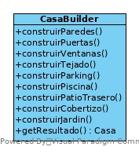
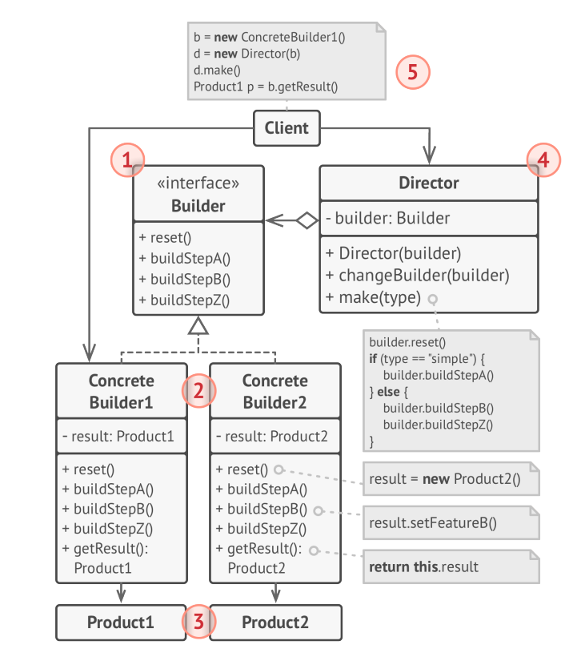
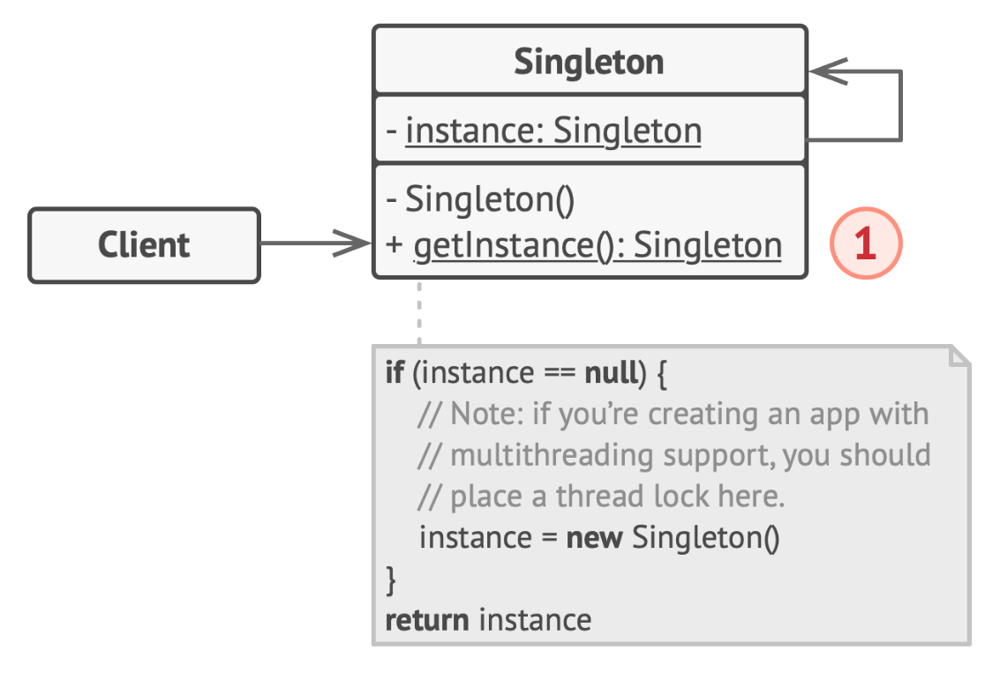
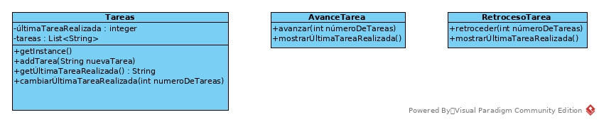

# Patrones de diseño

Existen tres tipos generales de patrones de diseño:
- Patrones creacionales.
- Patrones estructurales.
- Patrones de comportamiento.

Vamos a ir viendo tipos de cada uno, y finalmente, veremos el *rey de los patrones*, MVC, por ser una composición de varios tipo de patrón.

La lista de patrones es amplia, y sólo veremos algunos de ellos. La lista "oficial" de patrones es la siguiente:

- **Patrones creacionales:**
    - Factory Method
    - Astract Factory
    - Builder
    - Singleton
    - Prototype
- **Patrones estructurales:**
    - Adapter
    - Bridge
    - Composite
    - Decorator
    - Facade
    - Flyweight
    - Proxy
- **Patrones de comportamiento:**
    - Chain of Responsibility
    - Command
    - Iterator
    - Mediator
    - Memento
    - Observer
    - State
    - Strategy
    - Template Method
    - Visitor

> Esta lista es una propuesta del libro *Design Pattern, Elements of Reusable Object-Oriented Software* escrito por Erich Gamma, Richard Helm, Ralph Johnson, y John Vlissides, que fue el libro que popularizó el concepto de *patrón de diseño*.

## Patrones creacionales

> Los patrones creacionales proporcionan mecanismos para crear objetos, buscando incrementar la flexibilidad y la reusabilidad del código.

# Patrón número 1. Factory Method

Imaginemos que estamos creando una aplicación de gestión logística. La primera versión de la aplicación sólo trabaja con transportes en camión, de forma que en el código aparece la clase **Camión**. 
Supongamos que la aplicación se hace popular, y se reciben peticiones de compañías de transporte marítimo que desean que la logística marítima se meta también en la aplicación. Inicialmente, nuestra aplicación tiene el siguiente aspecto:


*Ilustracción artística de la apliación.*

Ahora mismo, el código estrá repleto de objetos *Camión* por todas partes. Para añadir los barcos, tendremos en primer lugar que crear una interfaz común para nuestros medios de transporte:


Suponiendo que esto es todo lo que hacemos, tendremos que modificar el código, allí donde aparezca la clase *Camión*, para añadir la clase *Barco*, terminando con fragmentos como el siguiente:

```
    Transporte t;
    if (tipoTransporte == Transporte.CAMION){
        t = new Camion();
    } else if (tipoTransporte == Transporte.BARCO){
        t = new Barco();
    }
```
Conforme vayan apareciendo nuevos medios de transporte, tendremos que volver a modificar el código, añadiendo el nuevo medio de transporte a lo largo de la aplicación.

## Solución. 

El patrón **Factory Method** sugiere que en lugar de crear directamente los objetos, los objetos sean creados por un método *factory* específico


1. **Product** declara la interfaz, que es común a todos los objetos que pueden ser creados y sus subclases.
2. **Concrete Products** son implementaciones diferentes de la interfaz *Product* (en nuestro caso, *Camión*, *Barco*, etc.).
3. **Creator** declara el método *factory* que devuelve el nuevo producto. Es importante que el tipo devuelto por este método sea de tipo *Product*. Se puede declarar el método *factory* como abstracto en la case base (*Creator*), para forzar a todas las subclases a implementar sus propias versiones del método. Como alternativa, la clase base puede devolver algún tipo *Product* por defecto.
4. **Concrete Creators** sobreescribe el método *factory*, de forma que devuelve diferentes tipos de producto.

> ¡OJO! Un *factory method* no tiene por qué crear nuevas instancias todo el rato. Puede también devolver objetos de una caché, una lista de objetos, etc.

## Ejemplo

Puedes ver un ejemplo en [src/Patrones_diseño.zip](https://github.com/MauricioMatamala/Programacion/blob/master/Patrones%20de%20dise%C3%B1o/src/patrones_dise%C3%B1o.zip)

## Cuándo aplicar el patrón *Factory method*

- Cuando no sepamos de antemano los tipos exactos de objetos con los que tendrá que trabajar el código. Con este patrón separamos la construcción de un objeto de su uso. 
- Cuando queramos proporcionar a los usuarios de nuestro código una forma de extender los componentes internos.
- Cuando queramos ahorra recursos de cómputo, reutilizando objetos que ya han sido creados anteriormente. Para reutilizar un objeto ya creado anteriormente:
    1. Debemos contar con un depósito donde almacenar los objetos creados (podría ser un objeto de clase *List*, por ejemplo).
    2. Cuando nos solicitan un objeto, el programa puede buscar un objeto libre en dicho depósito. Si existe dicho objeto, devolverlo.
    3. Si no hay objetos libres, se puede crear uno

## Ventajas e inconvenientes

- [Ventaja] Minimizamos el acoplamiento entre las clases cliente y sus dependencias.
- [Ventaja] Garantizamos el principio SRP, ya que quitamos la responsabilidad de crear el producto adecuado a la clase cliente.
- [Ventaja] Garantizamos OCP. Se pueden introducir nuevas clases de producto sin romper el código existente.
- [Inconveniente] El código se vuelve más complejo.

# Abstract Factory

Supongamos que estamos trabajando con varias categorías de vehículos, descritos mediante la siguiente imagen:


Necesitamos un sistema para crear vehículos individuales de forma que estén en consonancia con los otros objetos de la misma familia. Por ejemplo, si un cuerpo militar solicita un avión y un barco, éstos deberían ser de categoría militar.

También queremos evitar tener que cambiar el código cada vez que se añadan nuevos productos a la familia de productos. Imaginemos que agregamos también la categoría *futurístico* y *victoriano*.

## Solución 

Para empezar, el patrón *Abstract Factory* recomienda crear interfaces para cada producto distinto de cada familia (Barco, Autobús, Avión, etc.). Por ejemplo, en el caso del autobús:


El siguiente paso es crear una interfaz *Abstract Factory* con la lista de métodos de creación para todos los tipos de producto de una misma familia (por ejemplo, *crearTransporteTerrestre*, *crearTranporteAéreo* y *crearTransporteMarítimo*).

Finalmente, habrá que crear una implementación concreta de la interfaz *Abstract Factory* para cada familia de productos, en nuestro caso, militar, recreativo y público. De este modo, nuestro ejemplo quedaría así:


Supongamos que una clase cliente desea producir un vehículo terrestre. Es deseable que dicha clase no tenga que saber los datalles sobre si el vehículo debe ser militar o público. Además, debe tratar a todos los vehículos terrestres de la misma manera, sin preocuparle si se trata de un autobús, un camión militar o una autocaravana.

Entonces, ¿Quién crea las factorías concretas? El cliente no debe tener que saber qué tipo de *astract factory* concreto necesita. Por ello, un posible enfoque es crear un *astract factory* concreto en la fase de inicialización, dependiendo de la configuración de la aplicación.


1. **Asbstract Products** declaran las interfaces para un conjunto de productos del mismo tipo, de diferente familia (en el ejemplo anterior, TransporteTerrestre, TransporteAéreo y TransporteMarítimo).
2. **Concrete Products** son implementaciones de los *Abstract Products* (en el ejemplo anterior, para el *TransporteTerrestre*, estarían *Autobús*, *Autocaravana* y *Camión militar*).
3. **Abstract Factory** interfaz que declara el conjunto de métodos de creación de cada *Abstract Product*.
4. **Concrete Factory** implementa los métodos de creación del *Abstract Factory* para una familia de productos.

> ¡OJO! Aunque los *Concrete Factory* devuelven productos de un tipo concreto, la clase devuelta debe ser la del *Abstract Product* correspondiente. De este modo, se elimina el acoplamiento a una cierta familia de productos.

## Ejemplo

Puedes ver un ejemplo en [src/Patrones_diseño.zip](https://github.com/MauricioMatamala/Programacion/blob/master/Patrones%20de%20dise%C3%B1o/src/patrones_dise%C3%B1o.zip)

## Cuando aplicar *Abstract Factory*

- Cuando el código necesita trabajar con varias familias de productos relacionados, pero no se desea depedender de las clases concretas de estos productos (porque no se sabe la familia a usar de antemano, o bien deseamos garantizar la extensibilidad futura).

## Ventajas e inconvenientes

- [Ventaja] Garantiza la compatibilidad entre los productos creados por una misma clase *factory*.
- [Ventaja] Evita el acoplamiento entre los productos concretos y las clases cliente.
- [Ventaja] Garantizamos el principio SRP, ya que movemos la creación de los productos a un único lugar de la aplicación, haciendo el código más fácil de mantener.
- [Ventaja] Garantizamos el principio OCP, ya que introducimos nuevas familias de productos sin romper el código existente.
- [Inconveniente] El código se vuelve más complejo de lo que podría ser, ya que aparecen nuevas interfaces y clases para cubrir el patrón.

---------

# Patrón número 3: Builder

El patrón *Builder* nos permite construir objetos complejos paso a paso. Además, permite producir diferentes objetos utilizando el mismo código.

Este patrón suele ser utilizado en las inicializaciones largas de un cierto objeto con muchas opciones de configuración que dan lugar a: 

a. Un constructor monstruoso con muchos parámetros.

b. Código de configuración disemiado por muchas partes del código (esto es peor que un constructor monstruoso).


## Construir una casa

Imaginemos que tenemos que construir un objeto *Casa*. Una casa incluye 4 paredes, suelo, una puerta, varias ventanas y un tejado. Pero qué pasaría si quisiéramos una casa más grande, o más luminosa, con un patio trasero y piscina o un cobertizo.

La solución más inmediata es extender la clase *Casa* y crear un conjunto de subclases que cubran todas las combinaciones: *Mansión*, *CasaLujo*, *Granja*. Pero si las posibilidades siguiesen aumentando y hubiese una explosión de subclases, existe una alternativa. Un constructor con todos los posibles parámetros (constructor monstruoso). Un constructor monstruoso es largo, difícil de mantener, y sobre todo, difícil de llamar:

```
Casa casa = new Casa(paredes, ventanas, suelo, puerta, tejado, Casa.MANSION, true, true, false, false);
```

Un constructor así, no es código limpio. Cada vez que se haga una llamada al constructor, habrá que declarar todos los parámetros necesarios (y es fácil equivocarse en el valor de un parámetro).

## Solución

El patrón *Builder* extrae la construcción del objeto fuera de la propia clase, y llevarla a un objeto aparte, llamado *Constructor* o *Builder*. 

> Esta práctica está mal vista muchos programadores por considerarla un *code smell* (código que apesta). 



El patrón organiza la construcción en una serie de pasos (*construirParedes*, *construirVentanas*,etc.). La parte interesante, es que no hace falta pasar por todos ellos, y solo hay que pasar por los pasos necesarios en cada caso. Crear una casa con piscina y cobertizo se podría resolver así:

```
CasaBuilder casaBuilder = new CasaBuilder();
Casa casaConPiscina = casaBuilder.construirParedes()
                                 .construirPuertas()
                                 .construirVentanas()
                                 .construirTejado()
                                 .construirPiscina()
                                 .construirCobertizo()
                                 .getResultado();
```

## Cuando hay varias implementaciones posibles

Algunos de los pasos pueden requerir implementaciones diferentes. Por ejemplo, una casa puede ser un castillo, o una cabaña o un iglú. En este caso, se pueden crear diferentes clases *Builder* que implementen los mismos pasos, pero con diferente implementación.


## El director

Para dar una vuelta más de tuerca, se puede extraer el conjunto de pasos a una clase separa llamada *Director*. Esta clase define el orden correcto en que se deben ejecutar los pasos constructivos. 

No es necesario contar con un *Director*, pero éste ayuda a reutilizar secuencias constructivas cuando se repiten a lo largo del código. Otra ventaja de utilizar un *Director* es que oculta los detalles de construcción a la clase cliente, que únicamente le pasa al director un *Builder* concreto. El diagrama de clases, usando un director, podría quedar así:


Atendiendo a este diseño, la construcción de un castillo con piscina podría quedar como sigue:

```
ResidenciaBuilder castilloBuilder = new CastilloBuilder();
DirectorResidencia director = new Director(castilloBuilder);
director.crearResidencia(Residencia.CON_PISCINA);
Residencia castilloConPiscina = director.getResultado();
```
## Diagrama UML general del patrón Builder

El diagrama UML general del patrón Builder es el siguiente:



Donde:
- **Builder** es una interfaz común a todos los tipos de *builders* concretos.
- **ConcreteBuilder** son implementaciones diferentes del proceso constructivo. 
- **Product** es el resultado concreto de un proceso constructivo.
- **Director** define el orden en que realizan los pasos constructivo. Su finalidad es la reutilización de configuraciones concretas.
- **Client** es la clase cliente que utiliza el patrón. Existen dos posibilidades:
    - El cliente utiliza directamente un *ConcreteBuilder*, ejecutando uno a uno los pasos constructivos.
    - El cliente utiliza un *director* que lleva a cabo el proceso constructivo.

## Ejemplo

En el siguiente proyecto hay un ejemplo de aplicación del patrón *Builder*.

[ejemplos de patrones de diseño](src/patrones_diseño.zip)

## Cuándo aplicar el patrón Builder

El patrón Builder puede ser una opción a considerar cuando:

- Cuando nos vemos obligados a escribir un "constructor telescópico". Por ejemplo, imaginemos que tenemos un constructor con 10 parámetros. 

- Cuando hay una explosión de constructores (muchos constructores con diferentes parámetros).

- Cuando queremos que el código sera capaz de crear diferentes representaciones del mismo producto (como en el ejemplo de las residencias, para obtener un castillo con piscina, o una cabaña con parking).

## Ventajas e inconvenientes

- [Ventaja] Se pueden construir objetos paso a paso.
- [Ventaja] Se puede postergar la construcción completa del objeto hasta que se tenga toda la información, ya que hasta que no se ejecute el método *getResultado* de la clase *builder* no obtendremos el producto.
- [Ventaja] Se respeta SRP, aislando una construcción compleja del objeto de la lógica de negocio del mismo.
- [Desventaja] La complejidad del código se ve incrementada, y aumenta el número de clases necesarias.

# Patrón número 4: Singleton

El patrón singleton garantiza que sólo existe una instancia de una clase. Además proporciona un punto global de acceso a dicha instancia. 

> Sólo puede haber uno, y es visible siempre.

## Solución

El diagrama UML del patrón *Singleton* es:



## Singleton desgranado

La clave de *Singleton* es que contiene una referencia estática privada a una instancia de su mismo tipo.

```
Class Singleton{
    private static Singleton instancia = null;

    public getInstance(){
        if (instancia == null)
            instancia = new Singleton();
        return instancia;
    }

    // Métodos útiles de la clase
}
```

## Un ejemplo

Supongamos que tenemos una clase con información que sólo puede tener un estado estado durante la ejecución del programa. Supongamos también que tenemos que acceder a dicho desde distintos puntos del programa. 

Una opción puede ser pasar como parámetro la clase en cada punto donde debe ser consultada. En la mayoría de las situaciones esto es suficiente, pero puede convertirse en un laberinto conforme el programa crece. 

En nuestro ejemplo, se desea llevar un registro de las acciones realizadas por un usuario una interfaz gráfica, independientemente de la vista que se trate. Si aplicamos el patrón *Singleton*, cuando se produzca un vento, podemos ejecutar lo siguiente:

```
    LogAcciones logAcciones = LogAcciones.getInstance();
    logAcciones.anotar(acción);
```

Internamente, esta clase deberá mantener una lista de acciones. El código de nuestra clase *LogAcciones* podría ser la siguiente:

```
public class LogAcciones{
    private static LogAcciones instancia = null;
    
    private List<String> acciones;

    public LogAcciones(){
        acciones = new ArrayList<String>();
    }

    public static LogAcciones getInstance(){
        if (instancia == null)
            instancia = new LogAcciones();
        return instancia;
    }

    public void anotar(String acción){
        acciones.add(acción);
    }

    public List<String> getAcciones(){
        return acciones;
    }
}
```

puedes ver el ejemplo completo en [ejemplos de patrones de diseño](src/patrones_diseño.zip)

## Versión proactiva/perezosa

La inicialización de la instancia se puede hacer desde que se carga el programa en memoria, o bien cuando se solicite por primera vez la instancia. La versión mostrada en el apartado anterior es perezosa. La versión proactiva sería como sigue:

```
public class LogAcciones{
    private static LogAcciones instancia = new LogAcciones();
    
    private List<String> acciones;

    public LogAcciones(){
        acciones = new ArrayList<String>();
    }

    public static LogAcciones getInstance(){
        return instancia;
    }

    public void anotar(String acción){
        acciones.add(acción);
    }

    public List<String> getAcciones(){
        return acciones;
    }
}
```

## Cuándo aplicar Singleton

El patrón Singleton se puede aplicar cuando:
- Una clase debe tener una única instancia disponible para todos sus clientes.
- Se requiere un control estricto sobre una variable global.


## Ventajas e inconvenientes

- [Ventaja] Garantías de que existe una única instancia de una clase.
- [Ventaja] Acceso global a dicha instancia.
- [Ventaja] Objeto *singleton* inicializado sólo cuando es requerido.
- [Desventaja] Violación de SRP, ya que resuelve varios problemas a la vez.
- [Desventaja] Puede enmascarar un mal diseño. Cuando una clase cliente no puede acceder a otra debido a un mal diseño, *Singleton* puede ser una tentación para resolver el problema de manera cómoda y rápida. Sin embargo un objeto *singleton* está expuesto a todos los demás componentes, y usado de manera incorrecta destruye la ocultación de información.
---------
**Actividad 1**. Deseas poder mostrar información de texto por consola usando diferentes formatos. Para ello, cuentas con las siguientes clases:

- **TextDataViewer** - muestra el contenido de los objetos mediante texto plano.
- **HTMLDataViewer** - muestra el contenido de los objetos mediante código html.

Los datos que necesitas mostrar están en el archivo [poblacion-por-nacionalidades_2016-2018.xml](https://github.com/MauricioMatamala/Programacion/raw/master/Patrones%20de%20dise%C3%B1o/doc/poblacion-por-nacionalidades_2016-2018_alcobendas.xml). 

Para saber cómo mostrar la información, utilizarás un archivo de configuración llamado *.env* que incluye un parámetro llamado *viewer*. Por ejemplo si la impresión debe ser en html, *.env* contendrá:

```
viewer=html
```
en caso de querer mostrarlo en formato de texto, *.env* contendrá:
```
viewer=text
```
#### Cómo debe verse:
Supongamos la línea siguiente del archivo *poblacion-por-nacionalidades_2016-2018.xml*
```
<row Año="2016" Nacionalidad="Afganistán" Número_de_empadronados="9"></row>
```
El resultado en html debe ser como sigue:
```
<table>
    <tr>
        <th>Nacionalidad</th><th>Año</th><th>Total</th>
    </tr>
    
    ...
    
    <tr>
        <td>Afganistán</td><td>2016</td><td>9</td>
    </tr>
    
    ...
    
</table>
```
El resultado en texto debe ser como sigue:
```
Listado de empadronamientos:
    ...
    
    El total de empadronados en 2016 procedentes de Afganistán fue de 9 personas.
    
    ...
```
Aplica el patrón *Factory Method* para crear un proyecto que resuelva el problema. La información que debes mostrar por pantalla es la siguente: [poblacion-por-nacionalidades_2016-2018.xml](https://github.com/MauricioMatamala/Programacion/raw/master/Patrones%20de%20dise%C3%B1o/doc/poblacion-por-nacionalidades_2016-2018_alcobendas.xml)

------------------------

**Actividad 2**. En un juego hay diferentes escenarios posibles, y personajes acordes al escenario. En concreto, las posibilidades son las siguientes:

Escenario    | Jugador        | Villano | Obstáculos 
-------------|----------------|---------|------------------
**Selva**    | Indiana        | Molaram | Carcelero turco
**Desierto** | Patton         | Rommel  | Tanques
**Espacio**  | USS Enterprise | Khan    | Naves Klingon 

Dependiendo del Escenario elegido por el jugador, se crearán diferentes elementos para el juego. Es preciso que se traten de clases diferentes, puesto tendrán comportamientos diferentes. 

Escribe una clase llamada *SelectorJuego* que da al jugador la opción de elegir uno u otro escenario. Dependiendo de la elección, crea los elementos del juego necesarios.

-------------------

**Actividad 3**. Escribe un programa que cree un plan de actividades durante la estancia en un hotel de vacaciones. Existen varios servicios a los que un cliente puede acceder:

- Desayuno
- Almuerzo
- Cena
- Habitación simple, doble o suite
- Cama adicional
- Parque de atracciones
- Curso de kite surf
- Actividades infantiles
- Cine en la playa

Estos servicios se pueden contratar en packs, a saber:

- Pack básico (habitación simple y desayuno)
- Pack romance (habitación doble y cena)
- Pack familiar (habitación doble, cama adicional, desayuno, almuerzo, cena, parque de atracciones, actividades infantiles y cine en la playa)
- Pack padres relajados (habitación doble, cama adicional, desayuno, almuerzo, cena, actividades infantiles, curso de kite surf y cine en la playa)
- Pack deluxe (suite, desayuno, almuerzo y cena, curso de kite surf y cine en la playa)
- Pack deluxe familiar(suite, cama adicional, desayuno, almuerzo, cena, parque de atracciones, curso de kite surf, actividades infantiles y cine en la playa)

Escribe un programa que pregunte al cliente qué pack desea contratar, y que construya el plan deseado mediante el patrón builder.

----------------------

**Actividad 4**. Observa el siguiente diagrama:



Escribe un proyecto que incluya las tres clases del diagrama, descritas a continuación:

- *Tareas* implementa el patrón Singleton.      
    - *tareas* contiene una lista de cadenas de texto que representan tareas que deben ser realizadas.  
    - *últimaRealizada* con la posición de la última tarea realizada en la lista.
    - *addTarea* permite añadir una nueva cadena de texto a la lista de tareas.
    - *getÚltimaTareaRealizada* devuelve la cadena de texto de la lista en la posición *últimaTareaRealizada*.
    - *cambiarÚltimaTareaRealizada* toma un valor positivo o negativo como parámetro y modifica el atributo *últimaTareaRealizada*.
- *AvanceTarea* es una clase cliente de *Tareas*:
    - *avanzar* toma un número positivo, e incrementa *últimaTareaRealizada*.
    - *mostrarÚltimaTareaRealizada* devuelve la cadena de texto correspondiente a la última tarea realizada.
- *RetrocesoTarea* es una clase cliente de *Tareas*:
    - *retroceder* toma un número positivo, y decrementa *últimaTareaRealizada*.
    - *mostrarÚltimaTareaRealizada* devuelve la cadena de texto correspondiente a la última tarea realizada.

Escribe un programa que haga lo siguiente:

1. Insertar un conjunto de tareas en la clase *Tareas*.
2. Realiza varios avances y retrocesos en las tareas.
3. Cada vez que realices un avance o un retroces, muestra la última tarea realizada.
4. Antes de terminar, muestra la última tarea realizada y comprueba que la información es coherente con los avances y retrocesos realizados durante la ejecución.

NOTA: Toma las decisiones que consideres oportunas en cuanto a manejo de errores (como un índice de lista fuera de rango).
