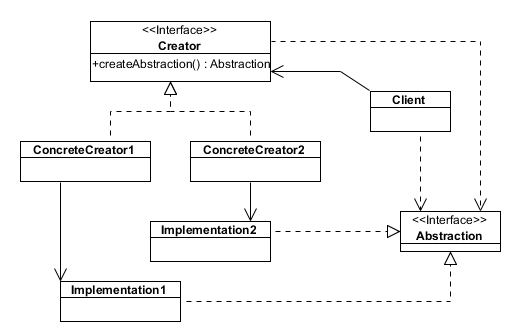
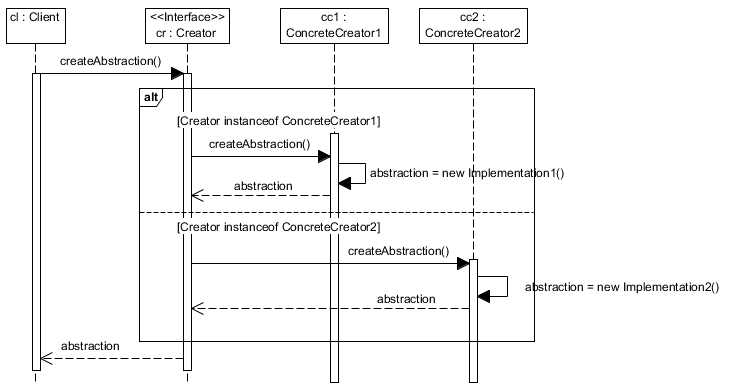

# Patrones de diseño

Un patrón de diseño describe un problema que ocurre una y otra vez en un determinado contexto, y describe el núcleo de la solución a ese problema, de forma que se puede utilizar una y otra vez sin hacerlo nunca de la misma manera. Esto es aplicable a muchos contextos del conocimiento, pero en el desarrollo de software, un patrón queda determinado por estos cuatro aspectos:

- **Nombre del patrón:** en una o dos palabras describiemos un problema de diseño. Conocerlos nos permite hablar en pocas palabras de ideas abstractas, y nos permite pensar de esa manera.

- **Problema:** cuándo aplicar el patrón. Se refiere al contexto en que se puede aplicar el patrón y las condiciones que se deben dar para poder aplicarlo.

- **Solución:** suele expresarse mediante diagramas UML, que indican las relaciones y su orden, responsabilidad y colaboraciones entre elementos.

- **Consecuencias:** resultados de aplicar el patrón. Es importante conocer cuáles son, para poder decidir y elegir el patrón más conveniente en cada caso, o si no es conveniente aplicarlo.

## Organización

Los patrones pueden organizarse en tres categorías principales:

- Creacionales
- Estructurales
- De comportamiento

## Principio que guía a los patrones de diseño

> PRINCIPIO DE DISEÑO: ORIENTAR EL CÓDIGO A INTERFACES, NO A IMPLEMENTACIONES

## Reutilizar el código

> TIP: No declarar variable de clases concretas. En su lugar utilizar interfaces definidas por una clase abstracta (OJO: HAY QUE INSTANCIAR CLASES CONCRETAS EN ALGÚN LADO, Y LOS PATRONES DE DISEÑO AYUDAN EN ESO: ARRINCONAR LAS DECLARACIONES CONCRETAS ALLÍ DONDE NO SE PUEDEN VER)

## Reutilizar código ¿Cómposición o herencia?
La herencia tiene ventajas e inconvenientes:

- Ventaja: Definida estáticamente en tiempo de compilación: su uso es claro y directo.
- Ventaja: Hace fácil reutilizar por redefinición.
- Inconveniente: Definida estáticamente en tiempo de compilación: no se puede cambiar la implementación de las clases padre en tiempo de ejecución.
- Inconveniente: Las clases hijas rompen la encapsulación de sus clases padre, es decir, cualquier cambio en el padre fuerza a la clase hija a cambiar.
- Inconveniente: Los detalles heredados pueden no ser adecuadas en nuevos problemas o dominios.

> La única solución a estas dependencias ese usar clases abstractas (tienen poca o ninguna implementación)

La composición también tiene cosas a favor y en contra:

- Ventaja: no rompe la encapsulación.
- Ventaja: un objeto puede ser reemplazado en tiempo de ejecución.
- Venjata: desarrollando con composición, el código se orienta más a las interfaces -> baja dependencia.
- Ventaja: favorecer la composición sobre la herencia, ayuda a mantener cada clase encapsulada y centrada en su trabajo.
- Desventaja: tiende a incrementar el número de objetos, y el comportamiento depende de las relaciones entre ellos, en lugar de definirlo estáticamente desde el principio.
        
> PRINCIPIO DE DISEÑO: FAVORECER LA COMPOSICIÓN SOBRE LA HERENCIA.

## La legibilidad es muy deseable, pero...

El software debe soportar el cambio: cuando sospechamos que una parte del código puede cambiar, debemos separarla.

Problema: crear un objeto indicando una clase explícitamente. Especificar una clase concreta cuando se crea un objeto nos empuja a una implementación en lugar de a una interfaz. Esto complicará cambios en el futuro.

# Factory method: 

**Problema**: Existe una clase abstracta Abstracta y sus subclases ConcretaA y ConcretaB con diferencias en su implementación. Se necesita un objeto de clase Abstracta, pero no se conocen de antemano los detalles y no se sabe que clase concreta hará falta (se sabrá solo en tiempo de ejecución).
    
> Opción mala: usar if else... -> código poco extensible, dependiente.

Cuando no se aplica Factory Method, el resultado es lo siguiente:

**Solución**: El patrón factory tiene el siguiente aspecto:

Usar cuando una clase no puede prever la clase de objetos que tiene que crear en tiempo de ejecución (esa información vendría dada por un archivo de configuración, por ejemplo).
    
**Consecuencias**: 

- Ventaja: elimina las asociaciones clase-función en el código.
- Ventaja: el código se orienta a interfaces, porque es transparente la clase concreta usada.
- Desventaja: podría ser necesario usar un Creador concreto.
    
        

