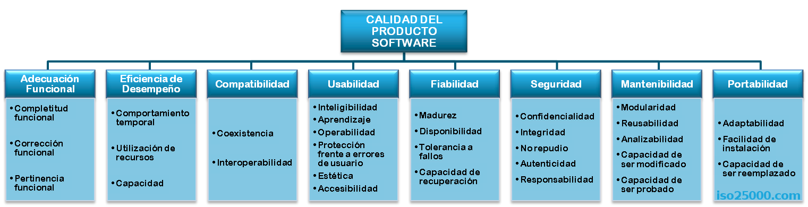
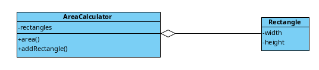
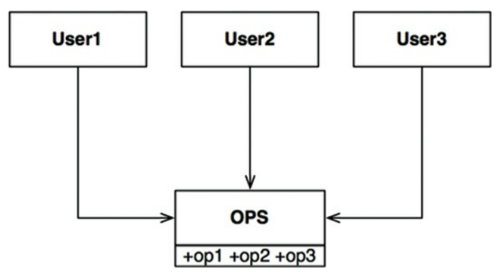
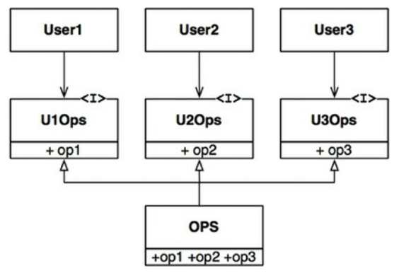
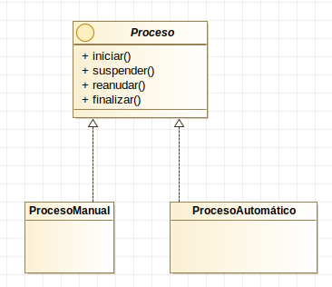
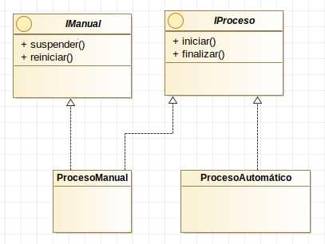

# Patrones de diseño

Antes de empezar, realizaremos algunos [ejercicios para repasar](repaso.md) lo visto hasta ahora.

# Principios de diseño de software de calidad

¿Qué es software de calidad? El conceto en *el mundo real* es el siguiente:


Existen muchas definiciones formales de *Calidad del Software*. La Norma ISO 25010, especifica el siguiente modelo:



El aspecto que nos interesa en este tema, es la *Mantenibilidad*. Aplicando los principios SOLID, garantizamos un ciclo de vida superior.

### SOLID (SRP, OCP, LSP, ISP, DIP)

SOLID es un acrónimo popularizado por Rober Martin en su libro *Clean Architecture*, que recoge 5 principios de diseño de software que promueven la calidad del software. 

S. Single Responsibility Principle
O. Open Close Principle
L. Liskov Substition Principle
I. Interface Segregation Principle
D. Dependency Inversion Principl

https://scotch.io/bar-talk/s-o-l-i-d-the-first-five-principles-of-object-oriented-design
Clean Architecture

# Single Responsitibility Principle

> Una clase debería tener una única razón para cambiar

Este principio se puede ver desde dos puntos de vista:

- Una clase debería dedicarse a una sola cosa
- Una clase debería ser usada por un único cliente (un cliente es una razón para cambiar)

Ejemplo: 


Supongamos que tanto *calcularSueldo* como *calcularHoras* comparten un algoritmo para calcular las horas no extras llamado *horasRegulares*. Supongamos también que el departamento de *RecursosHumanos* requiere un ajuste en el cálculo de horas no regulares: *Hay que añadir 30 minutos diarios que los empleados dedican a planificar el día siguiente*.

> PRINCIPIO DE DISEÑO: Separar el código del que dependen diferentes actores.

NOTA: No seguir este principio puede llevar a que los cambios en una parte provoquen cambios inesperados en otras partes de la aplicación, además de poder crear conflictos por cambios simultáneos en una parte del programa creados por diferentes desarrolladores.

Solución propuesta:


**Actividad SRP**. Escribe una aplicación que incluya una clase llamada *Mensaje*. Un mensaje tiene un remitente, un destinatario y un texto de mensaje. La clase contiene los siguientes métodos:

- *guardar*, que permite guardar el mensaje en un documento CSV. 
- *mostrar*, que formatea el mensaje para presentarlo por pantalla.
- *addDestinatario*, que añade un destinatario al mensaje.

La clase *Mensaje* es usada por las clases *UI*, *Pesistencia* y *Mensajeria*.

Plantea una solución que aplique SRP en la arquitectura, de forma que se permita añadir más métodos de guardado. Una vez que hayas implementado la solución, consulta los cambios en el [documento de cambios de requisitos](doc/cambios_solid.md):

------------------------------------

# Open Close Principle

> Todo artefacto debería ser escrito para su extensión, pero también para evitar cambios

------------------------

Ejemplo: 

Supongamos que contamos con una clase llamada *Rectangulo* que tiene un alto y un ancho. Se desea crear una aplicación que calcule el área total de un conjunto de rectángulos. Una implementación podría ser la siguiente.



El problema aparece si se quiere calcular el área total de un conjunto de rectángulos y círculos. El diseño anterior no se ajusta a OCP. Supongamos que deseamos agregar a los conjuntos de figuras, círculos y triángulos. Siguamos trabajando en una clase sin aplicar el principio OCP.


La clase AreaCalculator va aumentando el número de condiciones necesarias para realizar el trabajo.
----------------------------

Otro ejemplo:

Contamos con una clase llamada *LogInterno* que se encarga de escribir cierta información en un archivo. Imaginemos que la información a escribir incluye los siguientes items:

- Artefacto: artefacto al que se refiere la información
- Información: la información a registrar
- Nivel: indica si se trata de *información*, *advertencia*, *error* o *crítica*

La información se registra en un documento de texto, con una línea por cada información.

Ahora supongamos que surgen nuevas necesidades, y la información debe guardarse en un archivo XML. Si no se aplica el principio OCP, será necesario modificar una y otra vez el método de escritura.

-------------------------------------

> PRINCIPIO DE DISEÑO: Las partes de una clase que sospechemos que puedan sufrir cambios/ampliaciones, deben ser separadas.

Sean dos componentes A y B que mantienen una relación. Si un componente A debe ser inmune a los cambios en el componente B, entonces B debería depender de A y no al revés. De esta regla, se deriva el siguiente principio de diseño:

> PRINCIPIO DE DISEÑO: Los componentes de mayor nivel de abstracción (menos propensos a cambiar, dado que están más próximos a la lógica de negocio), deben estar protegidos de los cambios en los componentes de menor nivel de abstracción.


En esta imagen, la clase *Empleado* tiene un nivel de abstracción superior a *InformeEmpleado*. Por eso, la dependencia tiene el sentido indicado por la flecha (los cambios en los detalles de impresión no deben requerir cambios en la clase *Empleado*)

**Actividad OCP** Contamos con una clase llamada *Medidas* que incluye un conjunto de medidas. Estas medidas son longitudes, medidas en metros. Contamos con otra clase, llamada *Trayectoria* que utiliza estas medidas para realizar un cálculo en su método *calcular*, consistente en la suma de las medidas, multiplicadas por 0.97. Escribe el código necesario para cumplir con el enunciado.

> Una vez que termines, consulta las nuevas especificaciones en el [documento de cambios](doc/cambios_solid.md)

-------------------------------------------------

# Liskov Substitution Principle

> Si por cada objeto o1 de tipo S hay un objeto o2 de tipo T, de tal modo que todos los programas P, definidos en términos de T, el comportamienot de P no cambia cuando o1 es substituido por o2, entonces S es un subtipo de T

LSP es básicamente una extensión del principio abierto-cerrado. Lo que nos dice es que si tenemos una clase y varias subclases de esta al usar una referencia a la clase principal esta debe ser capaz de aceptar cualquier objeto de sus clases hijas. 

Ejemplo:
```
class Vehiculo
{
    // ...
    public int Cilindrada;
    // ...
}
 
class Ciclomotor extends Vehiculo
{
    public string ObtenerNumLicencia()
    {
        // Devuelve número de licencia
    }
    //...
}
 
class Coche extends Vehiculo
{
    public string ObtenerMatricula()
    {
        // Devuelve matrícula
    }
    
    //...
}
 
class Impuestos
{
    public void CalcularImpuesto(Vehiculo vehiculo)
    {
        String matricula = ((Coche)vehiculo).ObtenerMatricula();
        ServicioCalculoImpuestos(matricula, vehiculo.Cilindrada);
    }
}
```

LSP afirma que si tenemos dos objetos de tipos diferentes –Coche y Ciclomotor– que derivan de una misma clase base –Vehículo–, deberíamos poder reemplazar cada uno de los tipos –Coche/Ciclomotor y viceversa– allí dónde el tipo base –Vehículo– esté implementado. Una posible solución sería:

```
public void CalcularImpuesto(Vehiculo vehiculo)
{
    string matricula = "";
    if (vehiculo.GetTipo() == "Coche")
        matricula = ((Coche)vehiculo).ObtenerMatricula();
    else if (vehiculo.GetTipo() == "Ciclomotor")
        matricula = ((Ciclomotor)vehiculo).ObtenerNumLicencia();
    ServicioCalculoImpuestos(matricula, vehiculo.Cilindrada);
}
```
Esta clase aún viola el LSP. Esto es debido a que estamos forzando a un objeto Vehículo pasado como parámetro a comportarse como Ciclomotor o Coche.

LSP hace además recomendaciones sobre las relaciones de herencia:

- Las precondiciones no se pueden hacer más restrictivas en una subclase
- Las postcondiciones no pueden hacerse menos restrictivas en una subclase
- No se deben lanzar excepciones en un subtipo salvo cuando estas excepciones sean subclases de excepciones lanzadas por la superclase.

En resumen, las clases hijas no deben cambiar mucho el comportamiento de sus padres.

Por ejemplo, imaginemos que la clase *ControlAcceso* incluye un método llamado *validarContraseña*. Este método devuelve la contraseña cuando cumple las restricciones siguientes:
- La contraseña no es null
- La contraseña no es vacía

Si la contraseña es válida, devuelve la cadena. En caso contrario genera una excepción.

Si creamos la subclase *ControlAccesoMejorado*, violaríamos LSP si además incluimos la siguiente restricción:
- La contraseña no puede tener longitud menor a 8

> PRINCIPIO DE DISEÑO: en las relaciones de herencia, las superclases y las subclases deben poder ser intercambiables, o habrá que llenar el código de multitud de mecanismos para compensar las diferencias.

**Actividad LSP** Contamos con un proyecto llamado *Calculadora*. En este proyecto se manejan operaciones de diferente tipo, inicialmente sumas y restas. Las operaciones reciben operandos, realizan cálculos sobre ellos y devuelven un valor. Tanto la operación de *Suma* como la de *Multiplicación* contienen dos operandos.

La aplicación tendrá una clase llamada *Calculo* donde habrá un método llamado *calcular* que reciba la información necesaria sobre una operación y los operandos, que realice los cálculos y devuelve el valor calculado. 

Escribe una aplacación, intentando respetar LSP.

> Una vez que termines, consulta las nuevas especificaciones en el [documento de cambios](doc/cambios_solid.md)

-----------------------------------------------

# Interface Segregation Principle

> Las clases que implementen una interfaz o una clase abstracta no deberían estar obligadas a definir partes que no van a utilizar.

Es mejor tener interfaces específicos para cada cliente que uno de propósito general, o lo que es lo mismo, no deberíamos obligar a los clientes a depender de métodos que no utilizan.

Por ejemplo, supongamos que varios usuarios usan las operaciones de la clase *OPS*. Supongamos además que *User1* usa solamente *op1*, *User2* usa solamente *op2* y *User3* usa solamente *op3*. Entonces, el siguiente diseño viola el ISP.



Una solución al problema, pasaría por segregar las operaciones en diferentes interfaces, apropiadas para cada usuario.



-----------------------------

Cuando violamos el ISP, nos descubrimos escribiendo métodos vacíos o que solo devuelven *null*. Un ejemplo de esto podría ser el siguiente: una interfaz *Proceso* incluye los métodos *iniciar*, *suspender*, *reanudar* y *finalizar*. Supongamos que hay dos clases que la implementan: *ProcesoManual*, y *ProcesoAutomatico*. El proceso automático sólamente permite *iniciar* y *finalizar*.



Este diseño viola el ISP, ya que *ProcesoAutomático* lanzará únicamente excepciones al llamar a *suspender* y *reanudar*. Si aplicamos el ISP, el diseño quedará como sigue:



**Actividad ISP** En un sistema de control de medios de transporte, existe una interfaz llamada *Rastreable*, que incluye los métodos *getLatitud*, *getLongitud* y *getAltitud*. En el sistema se seguirán aviones, satélites, barcos, trenes y globos aerostáticos.
a) Implementa la solución violando el ISP.
b) Implementa la solución respetando el ISP.

---------------------------------------------------

# Dependency Inversion Principle

> Las dependencias deben hacer referencia a abstracciones, no a concreciones.

NOTA: En algún momento hay que trabajar con clases concretas. Lo que dice este princio es que debemos empujarlas a lo más profundo de la arquitectura, donde no puedan hacer daño en caso de cambio. 

Las dependencias peligrosas son las que hacen referencia a clases que puedan cambiar. Si se trata de clases estables que no sufrirán cambios, el problema no es tan grande.

*Inyección de dependencias* la inyección de dependencias es una técnica en la que se suministran objetos a una clase en lugar de ser la propia clase quien cree el objeto. Es una herramienta comúnmente utilizada en varios patrones de diseño orientado a objetos, consiste en inyectar comportamientos a componentes. El término fue acuñado por primera vez por Martin Fowler.

El siguiente código incumple el DIP:

```
public abstract class Saludo{
    public static final int AGRADABLE = 0;
    public static final int DESAGRADABLE = 1;
    public String saludar();
}

class SaludoAgradable implements Saludo{
    public String saludar(){
        return "Hola, ¿Qué tal todo?";
    }
}

class SaludoDesagradable implements Saludo{
    public String saludar(){
        return "¿Qué tripa se te ha roto?";
    }
}

class DarBienvenida{
    public String bienvenida(int tipo){
        Saludo saludo;
        if (tipo == Saludo.AGRADABLE)
            saludo = new SaludoAgradable();
        else if (tipo == Saludo.DESAGRADABLE){
            saludo = new SaludoDesagradable();
        return saludo.saludar();
    }
}

```

Hay varias soluciones posibles para inyectar las dependencias (en lugar de crearlas). La más obvia es pasarlas como parámetro:

```
class DarBienvenida{
    public String bienvenida(Saludo saludo){
        return saludo.saludar();
    }
}
```
Otra opción sería sería pasarle la papeleta a una clase que se encarge de construir el objeto apropiado:

```
class DarBienvenida{
    public String bienvenida(int tipo){
        Saludo saludo = ConstructorDeSaludos.construirSaludo(tipo);
        return saludo.saludar();
    }
}
```

**Actividad DIP** En un programa, la clase *GeneradorFigura* genera un tipo de figura dependiendo del tipo de hueco que le pasan. Los tipos de huecos posibles son:
- Hueco circular
- Hueco triangular
- Hueco cuadrado

A su vez, las figuras disponibles son:
- Círculo
- Triángulo
- Cuadrado

a) Implementa la solución sin respetar el DIP
b) Implementa la solución respetando el DIP

------------------------------------------------------

### DRY (Don't Repeat Yourself)

La versión opuesta es *WET* (We Enjoy Typing o Waste Everyone's Time)

### KISS (Keep It Simple Stupid)

Las cosas deben ser lo más sencillas posible, pero no más.

### YAGNI (You Aren't Gonna Need It)

Si sospechamos que una característica nos hará falta en el futuro, no es razón suficiente para desarrollarla ahora, ya que "No La Vas A Necesitar".
[YAGNI descrita por Martin Fowler](https://martinfowler.com/bliki/Yagni.html)

-------------------------------------------------------------

# Actividades del tema

**Actividad 1**. Implementa un CRUD con Swing sobre una base de datos llamada *Empleados*. La base de datos *Empleados* contiene una tabla llamada *Empleado* con la siguiente estructura:

Campo   |   Tipo    |   Clave primaria
--------|-----------|---------------------
id      | int       |  *
nombre  | varchar(50)|

La aplicación debe permitir consultar empleados a partir de un indicio de búsqueda (si el indicio es vacío se mostrarán todos los empleados). Además se debe poder insertar nuevos empleados, que se mostrarán de manera inmediata, nada más insertarlos. También se pueden modificar y borrar.

> Asegúrate de aplicar el principio SRP a la hora de implementar la persistencia de los datos.

Cuando implementes la solución, consulta el documento de [cambios de requisitos](doc/cambios_solid)