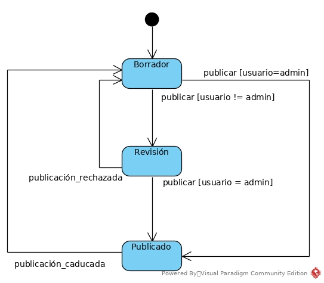
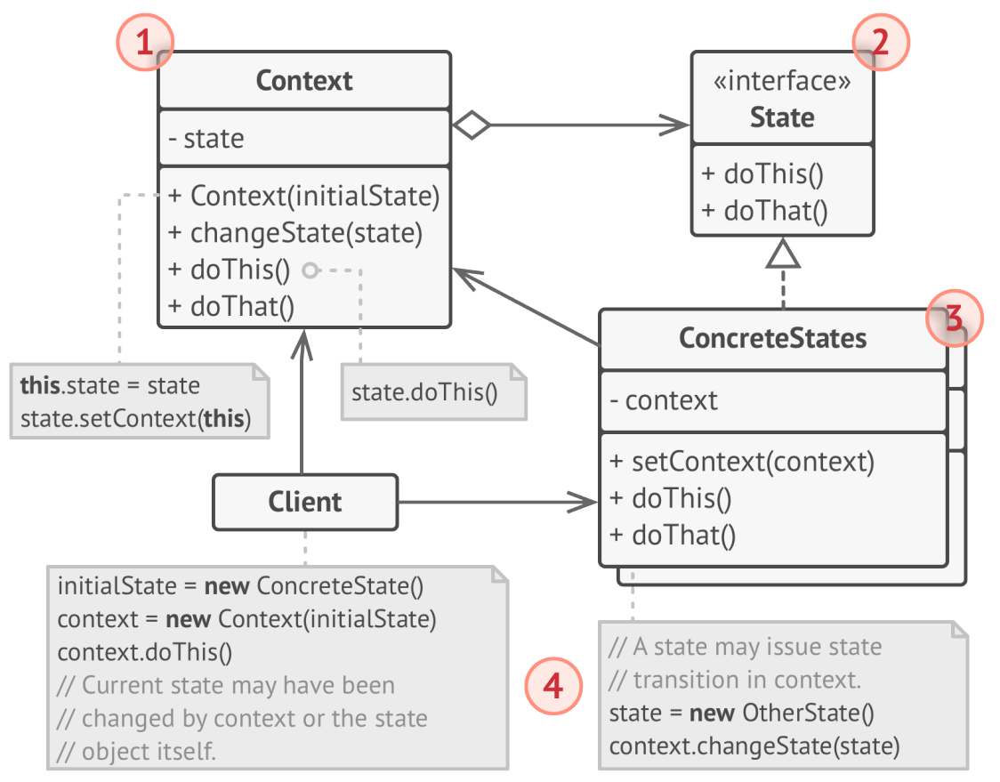

# Patrones de comportamiento

Los patrones de comportamiento (*behaviorla patterns*) están relacionados con los algoritmos y la asignación de responsabilidades entre objetos. Este tipo de patrones describen no solo las estructuras, sino también los patrones de comunicación entre ellos. 

Hay dos categorías, los *patrones de clase* y los *patrones de objetos*. Los patrones de clase de comportamiento usan la herencia para distribuir el comportamiento entre clases. Los patrones de objetos de comportamiento usan la composición de objetos en lugar de la herencia. 

## State

El patrón *State* permite que un objeto cambie su comportamiento según los cambios de estado internos. El resultado es que parece que un objeto ha cambiado la clase.

Cuando vimos las máquinas de estado en UML, terminanos utilizando sentencia *switch* para modelar el comportamiento. El principal problema que tiene este tipo de codificación se revela conforme se van añadiendo más estados a la clase. Cada vez más métodos tendrán sentencias de control condicional de gran tamaño que eligen el comportamiento adecuado. Es un código difícil de mantener ya que cualquier cambio en una transición puede requerir cambios en cada método. 

El problema se incrementa conforme un proyecto evoluciona, ya que es difícil predecir todos los estados y transiciones en la etapa de diseño. Por ello, lo que inicialmente es una sentencia condicional con un par de condiciones, pude convertirse en una masa de condiciones ilegible.

Esta forma de codificar no respeta el principio *OCP* y sus consecuencias a la larga son la pérdida de tiempo y dinero.

Supongamos que deseamos representar una clase Documento con un método *publicar* que puede tener los siguient estados:

- Borrador
- Revisión
- Publicado

El comportamiento del método *publicar* varía dependiendo del estado, lo que queda descrito en el siguiente diagrama:



Si no utilizamos este patrón, el método *publicar* contendrá un fragmento de código del siguiente tipo:

```
private int estado;

public void publicar(){
    switch(state){
        case Documento.BORRADOR:
            if (usuarioActual.rol == "admin")
                estado = Documento.PUBLICADO;
            else
                estado = Documento.REVISION;     
            //...
            break;
        case Documento.REVISION:
            if (usuarioActual.rol == "admin")
                estado = Documento.PUBLICADO;
            //...
            break;
        case Documento.PUBLICADO:
            // No hacer nada
    }
}
```
Este código puede ser mantenible mientras se trate de uno o dos métodos y pocos estados, con transiciones muy claras. Pero se convertirá en galimatías si se complica.

## Solución

El patrón *State* sugiere que se cree una clase para cada estado, y se ponga el código de comportamiento asociado a cada estado en dicha clase. La clase cuyos estados se están representando, debe contener una referencia, llamada *contexto*, a uno de estos estados, y delegar todo el trabajo de estado a dicho objeto.

La estructura general del patrón estado queda descrita en el siguiente diagrama UML:



Donde:

1. **Context** almacena una referencia a un objeto *ConcreteState* y delega su trabajo específico en él. *Context* se comunica con el objeto *ConcreteState* a través de la interfaz *State*. *Context* expone un *setter* para pasárselo a *ConcreteState*.

2. **State** es una interfaz que declara los métodos específicos de los estados. Estos métodos deberían tener sentido para todos los estados, ya que no es deseable tener estados con métodos inútiles (LSP).

3. **Concrete States**  proporcionan su propia implementación para cada estado específico. Para evitar duplicación de código similar a lo largo de varios estados, se pude utilizar una clase abstracta intermedia para encapsular el comportamiento común.

> Un posibilidad es que cada clase *Concrete State* tenga una referencia al objeto *Context*. De este modo, se puede obtener cualquier información de éste, así como iniciar transiciones de estado.

4. No existen limitaciones en cuanto a qué objeto inicia un nuevo estado, pudiendo ser tanto el objeto *Context* como los objetos *Concrete State* (en caso de contener una referencia al objeto *Context*)

Para cambiar el *contexto* a otro estado, hay que reemplazar el objeto actual apuntado por el atributo *estado*. 

## Cuando aplicar el patrón *State*

El patrón es aplicable en las siguientes circunstancias:

- Cuando tengamos un objeto que se comporta de forma diferente dependiendo de su estado, hay un gran número de estados y el comportamiento cambia con frecuencia.

- Cuando una clase contenga un exceso de sentencias condicionales que definan el comportamiento de la clase, en función de alguno de sus atributos.

- Cuando haya duplicación de código para estados y transiciones similares en una clase que se comporte como una máquina de estados.

## Ventajas e inconvenientes

- [Ventaja] Respeta el principio SRP.
- [Ventaja] Respeta el principio OCP.
- [Ventaja] Simplica el código de la clase *Context* eliminando los excesos de sentencias condicionales.
- [Inconveniente] Aplicar el patrón puede ser innecesario para pocos estados y cambios poco frecuentes, ya que añade complejidad a la arquitectura.

# Patrón *Strategy*

El patrón *Strategy* nos permite definir una familia de algoritmos, separarlos en clases diferentes, y crear sus objetos intercambiables.

Supongamos que hemos escrito una aplicación de navegación para viajeros aficionados. Nuestra aplicación tiene la clase *Navigator*, con un método llamado *crearRuta(origen,destino)*. Una de las características más apreciadas de tu aplicación es el trazado de la ruta más rápida. Pero entonces llegan solicitudes por parte de algunos usuarios una característica para trazar la ruta más turística. Así que añadimos esta característica, que es un éxito. Pero aparecen nuevas solicitudes, como caminos a pie, en transporte público, etc.

Cada vez que añadimos una nueva funcionalidad, nuestra clase *Navigator* duplica su tamaño, y empieza parecer un laberinto casi imposible de seguir. Aunque desde un punto de vista comercial sea un éxito, a nivel técnico la aplicación es una fuente de problemas. 

> La siguiente historia, incluida en el libro *Clean Code*, comenta lo siguiente sobre la diferencia entre escribir algo que funciona comercialmente, y algo que está bien escrito: *Sé de una compañía que a finales de los 80 escribió una aplicación de enorme éxito. Era muy popular, y legiones de profesionales la compraban y usaban. Pero entonces, los periodos entre versión y versión empezaron a crecer. Los bugs no eran reparados de una versión a la siguiente. Los tiempos de carga crecían y los bloqueos se incrementaban. Recuerdo el día en que desinstalé la aplicación, frustrado, para no volver a usarla de nuevo. La compañía abandonó el producto poco tiempo después. Dos décadas después, me encontré con uno de los primeros empleados de la compañía y le pregunté que había ocurrido. La respuesta confirmó mis sospechas. Habían lanzado el producto con un código poco cuidado. Conforme el código crecía y se añadían nuevas funcionalidades, el código se fue volviendo peor y peor hasta que simplemente no pudieron mantenerlo.*

## Solución

El patrón *Strategy* afirma que las diferentes formas de hacer una misma tarea, deben ser separadas a clases específicas, llamadas *Strategies* (o estrategias). El patrón es bastante parecido al patrón *State*, aunque con diferencias. El esquema general del patrón *Strategy* es el siguiente:


Donde:

1. **Context** mantiene una referencia a una estrategia concreta y se comunica con este objeto a través de una interfaz *Strategy*

2. **Strategy** es una interfaz común a todas las clases *Concrete Strategy*.

3. **Concrete Strategy** implementa diferentes variaciones de un algoritmo que utiliza el objeto *Context*.

4. El objeto *Context* ejecuta un método del objeto *Strategy* cuya referencia mantiene, cada vez que necesita ejecutar el algoritmo. *Context* no sabe qué tipo de objeto *Concrete Strategy* está utilizando.

5. *Client* crea un objeto específico de tipo *Strategy* y lo pasa a *Context*, que tiene un método *setter* para cambiarlo en tiempo de ejecución.

> Obsérvese que el patrón *Factory* es adecuado en el punto 5 para ocultar los detalles sobre el objeto *Strategy* utilizado.

## Cuándo aplicar el patrón *Strategy*

El patrón *Strategy* se puede utilizar en alguno de los siguientes casos:

- Cuando queremos utilizar variaciones de un cierto algoritmo dentro de un objeto y cambiar el algoritmo en tiempo de ejecución.

- Cuando queremos aislar la lógica de negocio de una clase de los detalles de implementación de los algoritmos utilizados, por ser estos irrelevantes respecto a dicha lógica de negocio.

- Cuando una clase tiene una sentencia condicional que permite elegir entre una variante del mismo algoritmo.


## Ventajas e inconvenientes

Las ventajas e inconvenientes de 

- [Ventaja] Se puede cambiar el algorimo utilizado en tiempo de ejecución.

- [Ventaja] Se pueden aislar los detalles de implementación de un algoritmo del código que lo usa.

- [Ventaja] Es un mecanismo sencillo para cambiar la herencia por la composición.

- [Ventaja] Respetuoso con el principio OCP. Se pueden introducir nuevas estrategias sin tener que cambiar el contexto.

- [Desventaja] Si se utilizan pocos algoritmos que cambian poco, no hay razón para complicar el código con nuevas clases e interfaces.

- [Desventaja] Las clases cliente deben conocer las diferencias entre los algoritmos para elegir el tipo apropiado (salvo que se utilice un patrón *factory*).

# Ejemplo de patrón *Strategy*

Si has visto *Terminator (1984)*, recordarás esta escena:

[](https://www.youtube.com/watch?v=zlJtohZSsfY)

En el siguiente enlace puedes consultar un ejemplo del patrón *Strategy* basado en la escena [Ejemplos de patrones de diseño](src/patrones_diseño.zip)

**Actividad 1.** (Sacada del baúl de los recuerdos) Supongamos que contamos con una lista de productos. Cada producto tiene un nombre, un precio y un índice de valoración que puede ir de 0 a 5. Los productos se pueden gestionar dentro de una clase llamada LoteDeProductos, que implementa los métodos siguientes:

    int getTotalProductos()
    Producto getProductoEnPosicion(int i)
    void addProducto(Producto producto))

Imagina que deseas obtener un mejor producto de la lista (Seller's Choice). Existen tres criterios para elegir el mejor producto:

    El mejor valorado.
    El más barato.
    Aquel que tenga mejor relación valoración/precio.

> NOTA: Puede que en el futuro se propongan otros criterios de elección.

Existe una interfaz llamada SelectorDeMejorProducto que incluye el siguiente método:

    LoteDeProductos elegirMejoresProductos()

Resuelve el ejercicio utilizando uno de los patrones anteriores.
