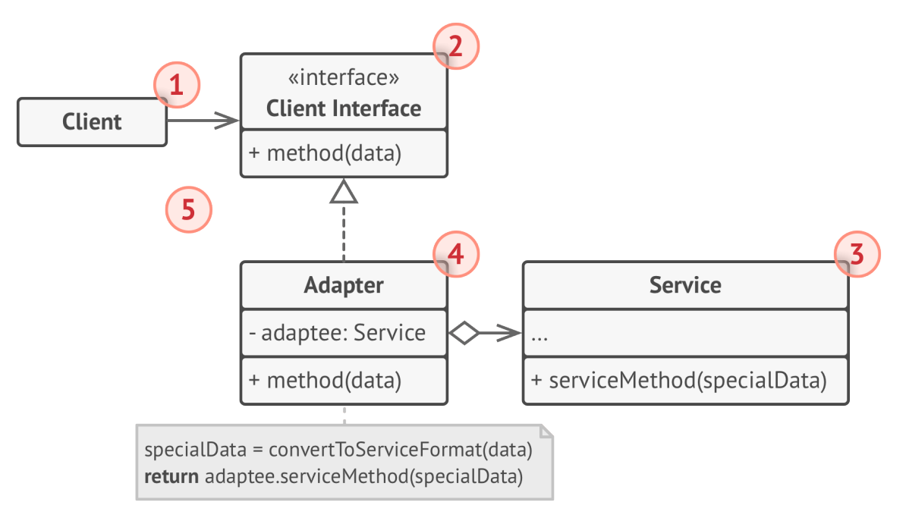
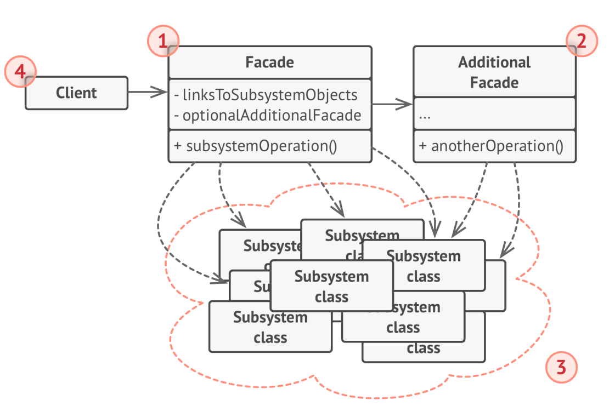
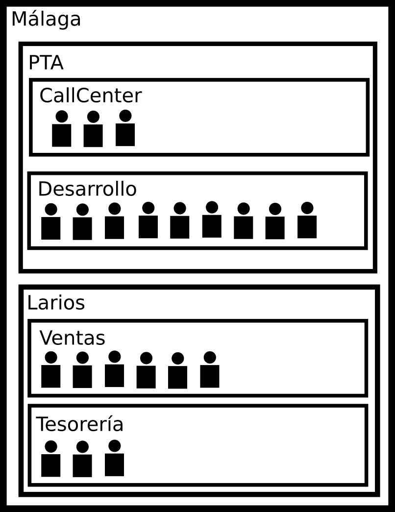

# Patrones de diseño

## Patrones estructurales

Según Erich Gamma, los patrones estructurales plantean maneras de formar estructuras más grandes con clases y objetos ya existentes. Los patrones estructurales crean nuevas funcionalidades y mantienen la flexibilidad necesaria para cambiar partes de la nueva estructura en tiempo de ejecución.

# El patrón Adapter 

El patrón adapter (también llamado *wrapper*) es un patrón de diseño que permite a objetos con interfaces incompatibles a colaborar

Supongamos que estamos escribiendo una aplicación para la monitorización del stock de mascarillas, es decir, muestra cuántas mascarillas hay en el mercado, y qué empresas las venden. Para ello, obtiene sus datos como documentos XML de un proveedor oficial de datos. Los datos XML son mostrados de una forma fácilmente interpretable por el usuario (mediante gráficos, por ejemplo).

En algún momento decidimos mejorar la aplicación integrando una librería de análisis de datos, que permita a nuestra aplicación detectar cambios y tendencias en el stock de mascarillas. El problema está en que esta librería que tenemos que usar trabaja con datos en formato JSON.

Todo el mundo piensa durante un segundo lo mismo: "cambiar el código de la librería para que utilice XML". Pero puede que la librería no sea nuestra, o que no podamos cambiarla porque otras partes del código dependen de ella.

## Solución

Usar un adaptador. Se trata de un objeto especial que convierte la interfaz de un objeto en otra, de manera que un tercer objeto pueda entenderlo.

Algunas característias que cumple un adaptador son:

- Un adaptador envuelve (de ahí el nombre *wrapper* o envoltorio) uno de los objetos para ocultar los detalles de la conversión.
- El objeto adaptado no sabe nada del adaptador. Ni siquiera es consciente de que está siendo adaptado.
- Un adaptador tiene una interfaz compatible con otro objeto cliente (inicialmente incompatible con el objeto adaptado).
- El adaptador pasa las llamadas del objeto cliente al objeto adpatado, pero en un formato y un orden que el objeto adaptado entiende.

En el ejemplo planteado sobre el mercado de las mascarillas, podemos crear un adaptador XML-JSON para cada clase de la librería de análisis que se utiliza directamente en el código. Después, debemos hacer los ajustes necesarios para que la comunicación se produzca solo a través de estos adaptadores. Cuando un adaptador recibe una llamada, traduce los datos en XML a JSON y los pasa a los métodos del objeto adaptado de análisis.

Existen dos manera de implementar una solución:

- Basándose en la composición: el adaptador implementa la interfaz de un objeto y envuelve a otro. Este patrón se denomina *Object Adapter*
- Basándose en herencia: el adaptador hereda simultáneamente la interfaz del cliente y del servicio.

## Descripción general del patrón *Object Adapter* (basado en composición)

El diagrama de clases general del patrón *adapter* es el siguiente:

Donde:

1. **Client** es una clas que contiene la lógica de negocio del programa.
2. **Client Interface**  describe el protocolo establecido para que otras clases se comuniquen con la clase cliente.
3. **Service** es una clas que nesitamos utilizar (de terceros o bien heredada de otro proyecto anterior). La clase *client* no puede usar directamente esta clase por una interfaz incompatible.
4. **Adapter** es una clase que puede trabajar tanto con *Client* como con *Service*. *Adapter* incluye una referencia a la clase *Service* como atributo. Lo que hace es implementar la interfaz de la clase *Client*, al tiempo de envuelve a la clase *Service*. La clase *Adapter* recibe llamadas desde el objeto *Client* a través de la interfaz y las traduce a llamadas al objeto envuelto en un formato que puede entender.
5. Gracias a la interfaz *Cliente Interface*, el código de la clase *Client* no tiene acoplamiento con una clase *Adapter* concreta. Gracias a esto, se pueden introducir nuevos timpos de adaptadores en el programa sin romper el código existente. Esto puede ser útil especialmente cuando hay cambios en la clase *Service*. Podemos añadir un nuevo adaptador, sin cambiar nada.

## Descripción general del patrón *Class Adapter* (basado en herencia)

Esta opción no es implementable de manera natural en Java, pero es posible verla en otros lenguajes que soportan la herencia múltimple. Su diagrama de clases general es el siguiente.

En este caso, la clase *Adapter* puede ser usada en lugar de *Existing Class*.

## Cuándo aplica el patrón *Adapter*

El patrón *Adapter* se puede usar en las siguientes circunstancias:

- Cuando queremos usar una clase existente cuya interfaz no se puede cambiar y no es compatible con el resto del código.

> Mediante el patrón *Adapter* creamos una capa intermedia entre la clase *Client* y la clase *Service*.

- Cuando queremos reutilizar diferentes subclases existentes a las que les falta cierta funcionalidad que no puede ser añadida a la superclase.

> La solución *horrible* para este problema es duplicar código en cada una de las subclases. La solución basada en *Adapter* es poner la funcionalidad en una clase *Adapter*. Para que esto funcione, las subclases deben tener una interfaz común.

## Ventajas e inconvenientes

- [Ventaja] Fomenta el principio SRP.
- [Ventaja] Fomenta el principio OCP.
- [Desventaja] Incrementa la complejidad del código.

# El patrón *Façade*

El patrón *Façade* proporciona una interfaz simplificada para una librería, un framework u otro conjunto de clases.

Supongamos que tenemos que utilizar una librería, con una lógica de negocio compleja, llena de clases con diferentes métodos y funcionalidades. Normalmente, habrá que inicializar los objetos, controlar las dependencias, ejecutar en el orden correcto, etc. Como resultado nuestro código está fuertemente acoplado a los detalles de implementación de la librería, lo que hará que el código sea frágil y falle con facilidad (esto es equivalente a manejar el motor de un coche manualmente).

## Solución

El patrón *Façade* (fachada) proporciona una interfaz sencilla a un subsistema complejo lleno de "partes móviles". Una clase *façade* debe proporcionar una funcionalidad limitada (en comparación con todo lo que el subsistema puede hacer), y se limita a ofrecer lo que las clases cliente necesitan.

Si por ejemplo utilizamos una librería profesional de vídeo, con decenas de funcionalidades, y nuestro deseo es únicamente codificar vídeos a un formato, sólo necesitamos una clase que haga lo siguiente:

## Descripción general de patrón *Façade*

El patrón *façade* queda descrito por el siguiente diagrama:

donde:

1. **Façade** proporciona acceso a una parte de la funcionalidad del subsistema. Sabe exactamente donde redirigir las solicitudes de la clase cliente para operar las "partes móviles" del subsistema
2. **Additional Façade** puede ser creado para evitar llenar una clase *Façade* de características sin relación, que lo conviertan a su vez en una estructura compleja. Los *Façade* adicionales se pueden usar por clases cliente o bien por otras clases *Façade*.
3. **Complex Subsystem** está formado por muchas clases. Para conseguir que haga algo de utilidad, probablemente hay que conocer los detalles de implementación, formas de inicializar, formato correcto de los datos, la manera de componer los diferentes elementos, el orden de llevar a cabo las acciones, etc. El subsistema desconoce por completo la existencia de una clase *Façade*.
4. **Client** usa *façade* en lugar de llamar un subsistema de objetos directamente.

## Cuándo aplicar *façade* 

Se utiliza *façade* en cualquiera de las siguientes circunstancias:

- Cuando se necesita una interfaz limitada y directa para usar un subsistema complejo.

- Cuando se desea estructurar un sistema en capas. Crear clases *façade* define puntos de entrada a cada nivel. Se reduce drásticamente el acoplamiento entre los subsistemas obligando a que se comuniquen únicamente a través de las clases *façade*.

## Ventajas e inconveminetes

- [Ventaja] Se puede aislar el código de la complejidad de un subsistema, ya sea código nuestro o de terceros.
- [Inconveniente] Un objeto *façade* puede terminar convirtiéndose en **El Objeto**. Llevado a un extremo, ninguna clase puede completar su función sin *El Objeto*. 

# El patrón *Composite*

El patrón *composite* es un patrón que nos permite componer objetos dentro de una estructura arbórea, y utilizarlos como si fueran objetos individuales. El una estructura *Composite* todos los elementos soportan operaciones comunes, como *ejecutar* o *calcular* por ejemplo. Pensar en *composite* es similar a pensar en una caja de un pedido por Internet. La caja principal puede contener otras cajas, que a su vez contienen cajas. Cada elemento, ya sea una caja o un producto, tiene un método común *obtener*. En el caso de una caja, *obtener* representa abrir la caja y extraer su contenido. En el caso de un producto, *obtener* es tomar el producto. Si vamos aplicando la operación *obtener* sucesivamente, en algún punto, llegamos a los productos.

----------------------

Por ejemplo, imaginemos una aplicación que almacena gestiona unidades organizativas y personas. Las reglas que rigen la estructura de datos es la siguiente:

- Las unidades organizativas son una forma de organizar personas. 
- Una unidad organizativa puede estas formada por otras unidades organizativas así como por personas. 
- Una persona es un nodo *hoja*, por lo que no contiene más elementos en su interior.

Supongamos también que el departamento de tesorería necesita saber cuánto debe pagar en sueldos a una persona o unidad organizativa.

El problema tiene una estructura claramente arbórea. Por ejemplo:

----------------------

El patrón *Composite* facilitará bastante las cosas para resolver este problema.

## Descripción general del patrón *Composite*

La estructura general del patrón *Composite* queda descrita por el siguiente diagrama:

donde:

1. **Component** es una interfaz que describe las operaciones que son comunes tanto para los elementos simples (en el ejemplo anterior los empleados) como para los compuestos (en el ejemplo anterior las unidades organizativas).
2. **Leaf** (hoja) es un elemento básico que no admite subelementos.
3. **Container** (contenedor o composite) es un elemento que tiene subelementos, que pueden ser otros elementos *hoja* o bien otros *contenedores*. Un contenedor no sabe el tipo concreto de sus elementos hijo. Funciona con todos los subelementos a través de la interfaz de *Component*.

> Cuando un contenedor recibe una solucitud, delega el trabajo a sus subelementos, y una vez ha conseguido un resultado, lo devuelve a la clase cliente.

4. **Client** es la clase cliente, que trabaja con la estructura a través de la interfaz **Component**. Como resultado puede trabajar de la misma forma con un elemento simple o con uno compuesto.

Como ejemplo puedes ver el código fuente del problema propuesto [aquí](src/UnidadesOrganizativas.zip).

## ¿Cuándo aplicar el patrón *Composite*?

El patrón *Composite* se puede aplicar en las siguientes circunstancias:

- Cuando se tenga que implementar una estructura arbórea.
- Cuando se desea que la clase cliente trabaje indistintamente con un elemento simple y con uno compuesto.

## Ventajas e inconvenientes

- [Ventaja] Se puede trabajar con estructura arbóreas complejas de manera cómoda.
- [Ventaja] Fomento del principio OCP: se pueden introducir nuevos tipos de elemento sin romper el código existente.
- [Inconveniente] Puede ser complicado proporcionar una interfaz común a todos los elementos (*hojas* y *contenedores*) cuando su funcionalidad es muy diferente, empujando el incumplimiento del principio LSP.

## La relación de *Composite* con *Builder*

El patrón *Builder* puede ser adecuado para la creación de una estructura *Composite*, ya que su construcción se puede hacer recursivamente.

## Ejemplo de implementación

Puedes ver el ejemplo de implementación del ejemplo planteado anteriormente en [patrones_diseño.zip](src/patrones_diseño.zip)

-----------------------

Actividad 1. En Swing, JTable permite mostrar objetos de forma tabulada. Hasta ahora hemos manejado las tablas usando un adaptador predefinido: *DefaultTableModel*. En este ejercicio vamos a crear nosotros nuestro propio adaptador, lo que ofrece más posibilidades.

El problema planteado es el siguiente: Existe una clase llamada *Persona* con los siguientes campos:

- *String nombre*
- *String apellidos*
- *int edad*

Por otra parte, contamos con una ventana como la siguiente:

Se desea implementar un adaptador para que el comportamiento de la tabla sea el mostrado en el siguiente vídeo:

[Vídeo explicativo del ejercicio del patrón adaptador](img/ad5.mp4)

Inicialmente existe una lista de personas. Los nombres de dichas personas pueden ser los mostrados en el vídeo u otros diferentes.

Para saber cómo funciona *AbstractTableModel*, te propongo los siguientes recursos:

1. [Documentación de Oracle sobre AbstractTableModel](https://docs.oracle.com/javase/7/docs/api/javax/swing/table/AbstractTableModel.html)
2. [Ejemplo de implementación](src/ejemploAdaptadorTableModel.zip)
3. [Apuntes resumidos sobre AbstractTableModelo](doc/AbstractTableModel.md)

--------------------------

Actividad 2. Supongamos que una empresa vende servicios con las siguientes características:
- Un servicio tiene un nombre y un precio. 
- Alungos tipos de servicio se pueden componer a su vez de más servicios, a lo que se le llama *paquete*.
- Algunos tipos de servicio son llamados *productos*, y no se pueden componer de más servicios.

Se desea poder almacenar esta información, y poder realizar las siguientes consultas sobre un servicio:

- *añadir un servicio* (sólo es posible en el caso de un paquete)
- *eliminar un servicio* (sólo es posible en el caso de un paquete)
- *asignar el precio a un servicio* (en el caso de un paquete, el precio corresponde a la tasa por el paquete, aparte de los productos contratados).
- *obtener el precio de un servicio* (en el caso de un paquete, el precio corresponde al precio total del servicio, incluyendo la tasa por paquete y los productos contratados) 

La siguiente imagen muestra un ejemplo paquete contratado por un cliente:

Desarrolla un proyecto en el que puedas construir paquetes de servicios, y calcular su coste. Como prueba de funcionamiento, construye el paquete de servicios mostrado en la imagen, y calcula el coste de:

- rack1 
- ilink1.1
- ilink1
- cloud
