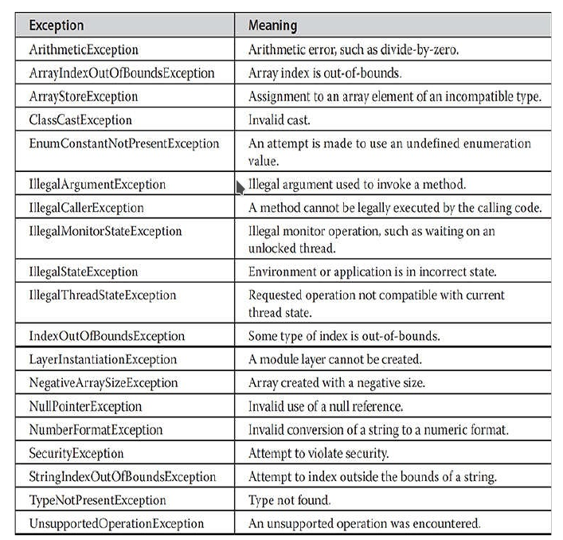

# Bloque 2. Programación orientada a objetos

> Este documento no pretende ser un manual exahaustivo, sino un guión de trabajo. Algunos aspectos no están detallados, o se limitan a un comentario que puede no ser suficientemente claro.

## 2.1. Introducción

Ver [documentación de referencia](https://desarrolloweb.com/articulos/499.php).

## 2.2. Clases y objetos
    
Ver [documentación de referencia](https://www.w3schools.com/java/java_classes.asp).

¿Cuál es la diferencia entre una clase y un objeto?
   
- Clase X: creación de un nuevo tipo de datos llamado X.
- Objeto X: variable de tipo X (instancia de la clase X).

### Variables de referencia a objetos

    Caja b1 = new Caja();
    Caja b2 = b1; // Ambas variables, b1 y b2, apuntan al mismo objeto.

    // ...

    b1 = null; // b1 no apunta a nada, pero b2 siguie apuntando al círculo original.

### Métodos
Ver [documentación de referencia](https://www.w3schools.com/java/java_class_methods.asp)

- Declaración de métodos en una clase.
- Devolución de valores.
- Parámetros

### Constructores
Ver [documentación de rerencia](https://www.w3schools.com/java/java_constructors.asp)

Los constructores son métodos especiales de inicialización del objeto. Pueden estar parametrizados.

### This

Ver [documentación de referencia](https://www.w3schools.com/java/ref_keyword_this.asp)

La palabra reservada *this* hace referencia al *objeto que lo utiliza*. Es habitual utilizar *this* en los constructores cuando sus parámetros coinciden con los atributos de la clase. Ej.

    Rectangulo(double ancho, double alto){
        this.ancho = ancho;
        this.alto = alto;
    }

### Sobrecarga de métodos y constructores

Ver [documentación de referencia](https://www.w3schools.in/java-tutorial/method-overloading/)

Se pueden sobrecargar los métodos y los constructores. 

#### Ej. Objeto *Caja* con sobrecarga de constructores:

- Se puede crear una caja a partir de 3 medidas (alto, ancho y fondo).
- Se puede crear una caja a partir de 1 medida (todos los lados iguales).
- Se puede crear una caja sin medida (porque no la conocemos aún).
- Se puede crear una caja a partir de otra caja (igual que la primera).

#### Ej. Objeto *ComprobadorDeTipoNumericoSimple*.

Podemos usar la sobrecarga para comprobar el tipo simple de una variable, sobrecargando el método *comprobarTipo* que recibe un parámetro:

- Si el parámetro es un entero, el método indica que la variable es de tipo *int*.
- Si el parámetro es un long, el método indica que la varaible es de tipo *long*.
- ...

### Recolección de basura

Cuando no existen referencias a un objeto, se libera la memoria que ocupa el objeto en cuanto ésta es reclamada por el recolector de basura.

---

### Abstracción de tipos de datos (Ej. un tipo de datos LIFO)

Una pila o estructura *LIFO* tiene varios métodos:

- *Push* : inserta un elemento en la pila
- *Pop* : estrae el último elemento insertado
- *Top* : muestra el elemento en la cima de la pila, pero no lo extrae.
- *Longitud* : indica el número de elementos que hay.

Con lo que sabemos hasta ahora, un pila tendrá dos limitaciones importantes:

1. Tendrá un tamaño máximo predefinido inicialmente.
2. Almacenará elementos de un cierto tipo concreto.

### Pasar objetos como parámetros

Pasar objetos como parámetros es muy habitual. Por ejemplo, ¿De qué forma podemos comparar dos cajas? ¿De qué forma podemos clonar una caja? Los métodos siguientes (sin implementar) podrían resolver estos problemas:

    Class Caja {
        
        int anchura, altura, profundidad;

        //...

        boolean esIgualQue( Caja caja ){
            if ((caja.getAnchura() == anchura) && 
                (caja.getAltura() == altura) &&
                (caja.getProfundidad() == profundidad))
                    return true;
            else return false;
        }

        void clonar( Caja caja ){
            anchura = caja.getAnchura();
            altura = caja.getAltura();
            profundidad = caja.getProfundidad();
        }

        //...
    }
    
### Paso por valor
Ver [documentación de referencia](https://www.arquitecturajava.com/java-value-vs-reference-y-sus-curiosidades/)

### Recursión
Ver [documentación de referencia](https://javadesdecero.es/intermedio/recursividad-con-ejemplos/)

### Static
Ver [documentación de referencia](https://javadesdecero.es/palabra-clave/static/)

- Variable estática: es una variable global que comparten todos los objetos de la clase.
- Método estático: se puede invocar sin crear un objeto de su clase. Ej. *Math.sqrt*
- Bloque estático: se ejecuta la primera vez que se hace referencia a la clase.

> *"Cualquier variable global es culpables mientras no se demuestre lo contrario."*    
Patterns of Enterprise Application Architecture. Martin Fowler

Las variables globales crean dependencias ocultas, y si cambia su valor, muchos objetos pueden verse afectados sin quedar del todo claro en el código.

### Final
Ver [documentación de referencia](https://www.w3schools.com/java/ref_keyword_final.asp)

Por consenso, se suelen declarar las constantes en letras mayúsculas.

### Clases anidadas

Ver [documentación de referencia](https://www.tutorialspoint.com/java/java_innerclasses.htm)

Las clases anidadas tienen especial sentido en programación orientada a eventos. En estos casos, los eventos pueden llegar a ser tan variados y tan abundantes que crear una clase para manejar cada uno de ellos puede empeorar la legibilidad del código. También puede tener sentido usarlas en los casos en que una clase de objetos B no tenga sentido que exista sin que exista otra clase de objetos A. Por ejemplo, podemos pensar en un libro titulado "Aprendiendo Java desde cero", que se publica en la editorial Antunez, con ISBN 12345678. Podemos decir el ejemplar no tiene sentido sin el libro. Es decir, en cierto diseño, la clase *Ejemplar* puede ser una clase interna de *Libro*.

## 2.3. Herencia y polimorfismo

### Control de acceso

Ver [documentación de referencia](https://javadesdecero.es/poo/modificadores-de-acceso/)

### Herencia

Ver [documentación de referencia](https://www.w3schools.com/java/java_inheritance.asp)

### [Super](https://docs.oracle.com/javase/tutorial/java/IandI/super.html)

Ver [documentación de referencia](https://docs.oracle.com/javase/tutorial/java/IandI/super.html)

### Jerarquía multinivel

Ver [documentación de referencia](https://csveda.com/java/java-multilevel-hierarchy/)

### Sobreescritura de métodos

En herencia de clases, cuando un método en una subclase tiene **el mismo nombre y signatura** que el método de su superclase, entonces el método en la subclase se dice que **sobreescribe** (*Override* en inglés) el método de la superclase. Cuando un método sobreescrito es llamado desde la subclase, siempre se ejecutará la versión definida en dicha subclase. La versión del método definida por la superclase será ignorada. Esta característica aporta una gran potencia a la POO, ya que es la base del polimorfismo.

### Polimorfismo

Ver [documentación de referencia](https://www.w3schools.com/java/java_polymorphism.asp)

### Clases abstractas

Ver [documentación de referencia](https://www.w3schools.com/java/java_abstract.asp)

### Final para evitar sobreescritura de métodos

Ver [documentación de referencia](https://www.tutorialspoint.com/using-final-keyword-to-prevent-overriding-in-java)

### Final para evitar la herencia

Ver [documentación de referencia](http://www.javawithus.com/tutorial/final-classes-and-methods)

### La clase Object
Ver [documentación de referencia](https://www.javatpoint.com/object-class)

## 2.4. Paquetes e Interfaces

### 2.4.1 Definir un paquete

Los paquetes son contenedores de clases. Permiten agrupar clases que tratan sobre el mismo tema.

### 2.4.2. Acceso a los miembros de una clase en función de su visibilidad

|                                | private   |   default    |      protected   |   public   |
|:-------------------------------|:---------:|:------------:|:----------------:|:----------:|
| Misma clase                    |   sí      |      sí      |       sí         |    sí      |
| Subclase en el mismo paquete   |   no      |      sí      |       sí         |    sí      |
| Clases del mismo paquete       |   no      |      sí      |       sí         |    sí      |
| Subclase en diferente paquete  |   no      |      no      |       sí         |    sí      |
| Clases en diferente paquete    |   no      |      no      |       no         |    sí      | 

### 2.4.3. Importación de todas las clases de un paquete

### 2.4.4. [Interfaces

Las variables declaradas dentro de una interfaz sólo pueden ser constantes (*final* y *static*).
Para implementar una interfaz se utiliza la palabra reservada *implements*.
Si hay más de una interfaz implementada por una misma clase, se separan sus nombres por ",".

Ver [documentación de referencia](https://javadesdecero.es/intermedio/interfaces-ejemplos/)

### 2.4.5. Interfaces y polimorfismo

- Una variable definida de tipo interfaz puede apuntar a objetos diferentes que la implementan.
- De esta forma se puede cambiar el comportamiento encapsulado por una variable sobre la marcha.

### 2.4.6. Clases abstractas

- Implementa solo una parte de la clase.
- Puede implementar una parte de una interfaz heredada y otra no.

Ver [documentación de referencia](https://javadesdecero.es/clases/abstract/)

### 2.4.7. Variables en interfaces

- Definición de constantes heredables, como tipos de empleados, o de habitación. Las variables deben ser constantes.

### 2.4.8. Interfaces que implementan interfaces

- Una interfaz puede implementar a otra.

### 2.4.9. interfaces con métodos defecto

- Disponibles a partir de JDK 8.
- Permiten extender las interfaces ya existentes sin romper el código de las clases que las implementan.
- Además amplían el abanico de implementaciones de la interfaz, ya que deja los métodos por defecto como de implementación "opcional".

Existe un comportamiento predefinido en caso de conflicto por implementación múltiple de interfaces con métodos por defecto coincidentes:
- Cualquier clase heredada tiene preferencia sobre una interfaz con un método por defecto definido.
- En caso de coincidencia de métodos por defecto definidos por interfaces implementadas por la misma clase, se produce un error.
- En casos en que una interfaz implementa otra, y ambas definen el mismo método por defecto, el método de la interfaz que implementa tiene preferencia.

Ver [documentación de referencia](https://javadesdecero.es/intermedio/metodos-interfaces/)

### 2.4.10. Métodos estáticos en una interfaz

Característica disponible a partir de JDK 8, que permite definir uno o más métodos estáticos en una interfaz. Por ello, se puede llamar directamente a dichos métodos, sin necesidad de que exista una instancia de la interfaz.

Ver [documentación de referencia](https://javadesdecero.es/intermedio/metodos-interfaces/)

### 2.4.11. Métodos privados en una interfaz

Característica disponible a partir de JDK 9. Una interfaz puede incluir un método privado que puede ser llamado sólamente por un método por defecto u otro método privado de la interfaz. Este comportamiento incluye a subinterfaces. Su única razón de ser es evitar la duplicación de código (en caso de que varias métodos por defecto utilicen el mismo fragmento).

Ver [documentación de referencia](https://javadesdecero.es/intermedio/metodos-interfaces/)

## 2.6. Excepciones
Ver [documentación de referencia](https://www.w3schools.com/java/java_try_catch.asp). En esta documentación se cubren los siguientes temas:

- Usar try y catch

- Mostrar la descripción de una exepción

- Múltiples catch

- throw y throws

- finally

### Lista de excepciones *checked*


### Lista de excepciones *unckecked*



### 2.6.6. Excepciones customizadas
Ver [documentación de referencia](https://www.javatpoint.com/custom-exception)

## 2.5. Colecciones

### 2.5.1. La interfaz Collection

La interfaz *Collection* está en lo más alto de la jerarquía de las colecciones. Proporciona todo lo que una colección de propósito general podría necesitar (y también lanza *UnsupportedOperationException*). *Collection* extiende la interfaz *Iterable*, que proporciona operaciones para recorrer una colección siguiendo el método *for-each*. El resto de colecciones (ya sean interfaces o clases) extienden a *Collection*, aunque están diseñadas para cubrir diferentes necesidades. Veamos cuáles son las principales:

#### 2.5.1.1. List

Las listas son lo más parecido a un array. Podemos acceder a sus elementos mediante un índice entero y buscar elementos en la lista. El índice empieza en 0 (igual que en un array).

#### 2.5.1.2. Set

Los conjuntos representan un conjunto **no repetido** de elementos sin un orden concreto. Sería lo más parecido a tener varios elementos no repetidos dentro de una bolsa. La interfaz *Set* no proporciona garantías de que los elementos se puedan devolver en un orden predecible, aunque algunas implementaciones (como TreeSet) mantienen el orden especificado por el programador.

#### 2.5.1.3. Map

Un mapa permite almacenar parejas de tipo *clave-valor*. Un mapa no puede tener claves repetidas, y cada clave puede apuntar a un único valor. Algunas implementaciones permiten mantener el orden entre los elementos según el orden natural (o establecido) de las claves.

#### 2.5.1.4. Cola

Una cola almacena los elementos para su posterior consumo. Las colas que implementan *Collection* permiten la operaciones básicas de una colección, pero además, agregan las operaciones de inserción de la teoría de colas (insertar y extraer). Una cola no necesariamente ordena los elementos según su orden de llegada. Hay más estrategias de ordenación, como las colas de prioridad, en que los elementos se ordenan según un orden preestablecido.


## LISTAS

### 2.5.1. ArrayList

Es el equivalente dinámico a un array. Su tamaño se adapta según se necesita. Ver [documentación de referencia](https://docs.oracle.com/javase/8/docs/api/java/util/ArrayList.html)

### 2.5.2. LinkedList
Sigue siendo una lista, aunque con operaciones de colas y pilas. Ver [documentación de referencia](https://docs.oracle.com/javase/8/docs/api/java/util/LinkedList.html)

## CONJUNTOS

### 2.5.3. HashSet
Ver [documentación de referencia](https://docs.oracle.com/javase/8/docs/api/java/util/HashSet.html)

### 2.5.4. TreeSet
Ver [documentación de referencia](https://docs.oracle.com/javase/8/docs/api/java/util/TreeSet.html)

## COLAS

### 2.5.5. PriorityQueue
Ver [documentación de referencia](https://docs.oracle.com/javase/8/docs/api/java/util/PriorityQueue.html)

## MAPAS

### 2.5.6. HashTable
Ver [documentación de referencia](https://docs.oracle.com/javase/8/docs/api/java/util/Hashtable.html)

### 2.5.7 TreeMap
Ver [documentación de referencia](https://docs.oracle.com/javase/8/docs/api/java/util/TreeMap.html)

## OTRAS COLECCIONES
Ver [documentación de referencia](https://docs.oracle.com/javase/8/docs/api/java/util/Collection.html)

**Acctividad 1.** Crea una clase llamada *Libro* que incluya la siguiente información del libro:
- Título
- Autor
- Editorial
- Número de edición
- ISBN

Además, la clase *Libro* contará con varios constructores parametrizados:
- Libro(titulo, autor)
- Libro(titulo, autor, editorial, numeroEdicion, isbn)

También contará con métodos para asignar valores a los atributos, y para consultar su valor. Por ejemplo, para el atributo *titulo* existirán los métodos:
- setTitulo(titulo)
- getTitulo()

Finalmente, escribe un programa que solicite la información de varios libros y los almacene en sus objetos correspondientes. Al terminar, el programa deberá mostrar un listado con los datos recogidos. 

**Actividad 2.** Partiendo del código propuesto en [Pasar objetos como parámetros](#pasar-objetos-como-parametros) completa la clase Caja, y escribe un programa basado en el siguiente código:

    Caja caja1 = new Caja(3,3,5);
    Caja caja2 = new Caja(caja1);
    Caja caja3 = new Caja(5);

    System.out.println("¿ caja1 es igual que caja2 ? ==> " + caja1.esIgualQue(caja2)); 
    System.out.println("¿ caja1 es igual que caja3 ? ==> " + caja1.esIgualQue(caja3));

**Actividad 3.** Escribe un programa recursivo que resuelva la [serie de Fibonacci](https://es.wikipedia.org/wiki/Sucesi%C3%B3n_de_Fibonacci). Para ello, crea una clase llamada *Fibonacci*, que incluya el método siguiente:

    int termino(int n)

Dicho método toma el número de término y devuelve el valor del término. Por ejemplo, el término número 10 de la serie de *Fibonacci* es 34.

**Actividad 4.** Escribe una clase LIFO (estructura de datos *Last In First Out*) llamada *Pila* que almacena enteros, siguiendo las siguientes indicaciones:
- una constante llamada *LONGITUD_MAXIMA* con el valor 1000, que representa el número máximo de elementos que puede contener la pila.
- un método llamado *insertar* que permite insertar un nuevo número.
- un método llamado *extraer* que permite extraer el número que está en la cima.
- un método llamado *cima* que muestra el contenido de la cima, pero no lo extrae.
- un método llamado *longitud* que devuelve el número de elementos actual.

Escribe un programa que utilizando la clase *Pila* tome una secuencia de números y los devuelva en orden inverso.
 
 **Actividad 5.** Revisa el ejercicio 4. Deseas una estructura de datos que además de todas esas operaciones, tenga dos operaciones adicionales:

 - *insertarElementoEnPosicion*, que acepta dos enteros, uno indicando el valor a insertar y el otro la posición donde se insertará. El método insertará el elemento en la posición pedida, desplazando el resto de elementos de la parte superior de la pila.

 - *ordenar*, que ordena los elementos según un orden aritmético. El método acepta dos posibles constantes (declaradas en la misma clase):
    - DE_MENOR_A_MAYOR
    - DE_MAYOR_A_MENOR

```
    // Ayuda: el siguiente algoritmo es llamado burbuja, y permite ordenar secuencias de datos.
    public static void burbuja(int[] a) {
        int n = a.length;
        for (int i = 0; i <= n - 2; i++)
            for (int j = n - 1; j > i; j--)
                if (a[j - 1] > a[j])
                    permuta(a, j - 1, j);
    }
```

**Actividad 6.** Durante el desarrollo de una aplicación de gestión de personal, surge la necesidad de cubrir esta historia: "*Calcular la nómina de cada trabajador, dependiendo de su tipo*".

Los empleados pueden ser de tres tipos:

- Comisionados: cobran un sueldo base, y un sueldo extra de 50€ por venta realizada.
- Por horas: cobran una cierta cantidad por cada hora trabajada, multiplicada por el número de horas trabajadas.
- Asalariados: cobran una cantidad fija al mes.

Deberás simular una base de datos de empleados mediante un *array* que aloje los tres tipos de empleados. El objetivo del ejercicio, es recorrer el *array* de trabajadores y generando un informe, que indique los datos básicos de cada trabajador (nombre, apellidos), así como los datos asociados a su tipo (horas trabajadas, ventas, etc) y la cantidad a percibir en función del tipo de trabajador que sea.

**Actividad 7.** Modifica el código del ejercicio anterior, para que la clase Empleado tenga métodos abstractos (¡Ojo! con algún sentido práctico).

**Actividad 8.** Vuelve a modificar el ejercicio anterior, para que las clases tengan implementado el método *toString*. Basa el informe de las nóminas en este método.

**Actividad 9.** Escribe un programa que pueda almacenar diferentes tipo de figuras geométricas: círculos, triángulos y cuadrados. Todas las figuras tienen un color, y tienen una manera particular de obtener el área.
Escribe un programa que contenga un array de figuras geométricas. Deberás recorrer el array e imprimir para cada figura el tipo de figura de que se trata, su color y su área.

**Actividad 10.** Una organización envía paquetes de publicaciones (libros y revistas) a negocios que desean contar con material de lectura en sus salas de espera. Cada paquete es una lista de libros y revistas. Las características comunes que se almacenan tanto para las revistas como para los libros son:

- el código, 
- el título, 
- el año de publicación, y
- prestado

Las tres primeras características se pasan por parámetro en el momento de crear las publicaciones, mientras que prestado es falso inicialmente. Se considera que las publicaciones no han sido prestadas hasta que no se han enviado en un paquete a su destinatario. Las publicaciones dejan de estar prestadas cuando son devueltas a la organización.

Las revistas tienen un *número de ejemplar* (en el momento de crear las revistas se define el número de ejemplar).

Tanto las revistas como los libros deben tener implementar toString() que devuelve un resumen. También tienen un método que devuelve el año de publicación, y otro el código.

Para prevenir posibles cambios en el programa se tiene que implementar una interfaz **Prestable** con los métodos *prestar()*, *devolver()* y *estaPrestado()*.

Crea un programa que permite:
- Mostrar los libros y revistas de la organización.
- Mostrar los libros y revistas prestados
- Mostrar los libros y revistas devueltos o no prestados.

**Actividad 11.** Supongamos que contamos con una lista de productos. Cada producto tiene un nombre, un precio y un índice de valoración que puede ir de 0 a 5. Los productos se pueden gestionar dentro de una clase llamada LoteDeProductos, que implementa los métodos siguientes:

- int getTotalProductos()
- Producto getProductoEnPosicion(int i)
- void addProducto(Producto producto))

Imagina que deseas obtener un mejor producto de la lista (Seller's Choice). Existen tres criterios para elegir el mejor producto:

- El mejor valorado.
- El más barato.
- Aquel que tenga mejor relación valoración/precio.

NOTA: Puede que en el futuro se propongan otros criterios de elección.

Existe una interfaz llamada *SelectorDeMejoresProducto* que incluye el siguiente método:

- *LoteDeProductos elegirMejoresProductos()*

Implementa los métodos de elección propuestos anteriormente mediante implementaciones específicas de esta interfaz.

**Actividad 12.** Nos han encargado una aplicación para gestionar un aparcamiento de vehículos requisados. Cuando llega un nuevo vehículo, se anotan una serie de datos, que varían dependiendo del tipo de vehículo. Por ejemplo, los datos según vehículo serían los siguientes:

- Barcos
    - Nombre
    - Fecha de fabricación
    - Fecha de entrada
    - Número de bastidor
    - Eslora
    - Calado
    - Manga

- Camiones
    - Matrícula
    - Fecha de entrada
    - Fecha de fabricación
    - Número de bastidor
    - Ancho
    - Altura
    - Longitud

- Coches
    - Matrícula
    - Fecha de entrada
    - Fecha de fabricación
    - Número de bastidor
    - Ancho
    - Altura
    - Longitud

Los vehículos, una vez requisados pasan a formar parte de la lista de vehículos en espera a ser subastado. Conforme se van autorizando nuevas subastas, los vehículos pasan a subasta. Una vez vendidos, entran en la lista de vendidos, junto con los datos del vendedor y el precio de venta.

Los vehículos pueden ser comprados por dos tipos de compradores:
- Personas físicas
    - Nombre y apellidos
    - DNI
    - Dirección

- Personas jurídicas
    - Nombre
    - CIF
    - Razón social

NOTA: También pueden haber personas extranjeras que no tengan DNI, y en su lugar cuenten con un NIE.

El programa debe permitir hacer lo siguiente:

1. introducir nuevos vehículos en el depósito, 
2. poner en subasta un vehículo,
3. registrar compradores autorizados,
3. vender un vehículo subastado a un comprador registrado por un precio, y en una fecha concreta,
4. registrar un vehículo como vendido,
3. listar la información de los vehículos del depósito,
3. listar los vehículos que están en espera a ser subastados,
3. listar los vehículos vendidos, y a qué comprador se han vendido así como el precio y la fecha de venta

**Actividad 13.** Revisa el ejercicio 4. En dicho ejercicio se produce una situación excepcional cuando intenta sacar un número de una cola vacía. Inicialmente se solventó devolviendo un número muy pequeño (Integer.MIN_VALUE). Modifica el código para que la excepción pueda ser capturada y gestionada adecuadamente.

**Actividad 14.** Revisa la actividad 11. Hay ciertas situaciones que se pueden considerar excepcionales:
- intentar obtener un producto en una posición que no existe.
- intentar insertar un producto *null*.

Añade el código necesario para que dichas situaciones excepcionales estén correctamente manejadas. Para ello, crea las siguientes excepciones:

- ProductPositionException
- NullProductException

Dota al código del manejo de la excepción que consideres más oportuno.

**Actividad 15.** La clase *RankingPilotos* mantiene una lista de pilotos participantes en una carrera automovilística. Dicha clase implementa los siguientes métodos:

- añadirPiloto(Piloto piloto, int posicionDeSalida)
- adelantarPiloto(Piloto piloto)
- retrasarPiloto(Piloto piloto)
- eliminarPilotosDescalificados()
- ordenarPilotosPorPosicionDeSalida()
- ordenarPilotosPorNombre()

La clase *Piloto* incluye varios campos:

- nombre 
- escudería
- posicionDeSalida
- descalificado 

Implementa un programa que mantenga la lista de pilotos según las operaciones realizadas sobre *RankingPilotos*. El archivo con los datos sobre los pilotos es el siguiente: [pilotos.csv](docs/pilotos.csv). Los sucesos que deben representarse correctamente son los siguientes:

1. Los pilotos están inicialmente colocados según su orden de salida.
2. Los pilotos son ordenados según su nombre.
3. El piloto *Hamilton L.* adelanta hasta la tercera posición y *Magnussen K.* hasta la novena.
4. Los pilotos *Albon A.* y *Grosjean R.* son descalificados.
5. Los pilotos vuelven a ser ordenados según su orden inicial de salida, teniendo en cuenta que los decalificados no aparecen.

NOTA: En los informes del contenido de *RankingPilotos* debe indicarse:
a) La posición actual de cada piloto.
b) Su posición inicial de salida.
b) Sus datos básicos (nombre y escudería).

**Actividad 16.** En el juego de la Oca, un jugador avanza por las casillas, identificadas por un número. El jugador parte inicialmente de la casilla 0. El avance a lo largo de las casillas depende del valor obtenido al tirar un dado. Se cuenta con la clase Jugador, que incluye los siguientes atributos y operaciones:

- color
- nombreJugador
- casillaActual
- avanzarCasillas(número)
- retrocederACasilla(número)

Se desea dotar a los jugadores con un historial de comandos, así como con las operaciones "redo" y "undo". Un jugador tiene acceso a las siguientes operaciones:

- historial(): devuelve todos los movimientos realizados hasta el momento.
- undo(): deshace un movimiento. Se pueden deshacer movimientos hasta llegar al primero.
- redo(): rehace un movimiento deshecho. Se pueden rehacer movimientos hasta llegar al último realizdo.

>> NOTA: No es necesario tener en cuenta la dinámica de juego de la Oca. Símplemente desarrollar la funcionalidad comentada. El historial debe mostrarse del siguiente modo:

```
El jugador RMS realizó los siguientes movimientos:
1. Avance a la casilla 4
2. Avance a la casilla 6
3. Avance a la casilla 9
4. Avance a la casilla 15
5. Avance a la casilla 16
6. Retroceso a la casilla 8
7. Avance a la casilla 9
8. Avance a la casilla 12
9. Retroceso a la casilla 3
```
