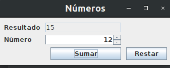
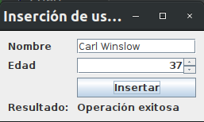
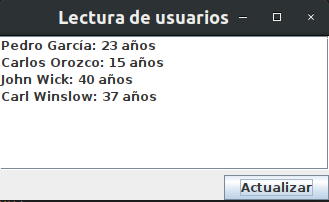
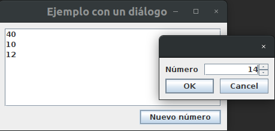
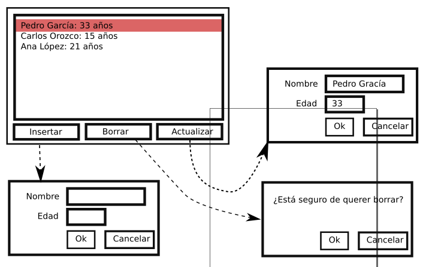

# Actividades prácticas resueltas con BBDD y Swing

A continuación se muestran actividades prácticas con conexión a BBDD y Swing, así como sus soluciones.

**Actividad de repaso 1**. Instala un servidor MySQL localmente. Crea una base de datos llamada **Usuarios** con una tabla llamada **usuarios** con una estructura como la siguiente:

```
create table usuarios
(
	id int auto_increment,
	nombre varchar(64) not null,
	edad int not null,
	constraint usuario_pk
		primary key (id)
);
```
Crea una clase llamada *Usuario* que incluya los siguientes atributos:
- *id* de tipo *int*
- *nombre* de tipo *String*
- *edad* de tipo *int*

Además, incluye sus getter/setters. 

Después, escribe el código necesario para llevar a cabo las siguientes tareas:

1. Insertar los usuarios siguientes:
    - "Pedro García", 33 años.
    - "Carlos Orozco", 15 años.
    - "Ana López", 21 años.
2. Leer de la base de datos los datos anteriores y cargarlos en una lista de tipo *List\<Usuario>*. Recorre la lista, mostrando el contenido de los objetos que contiene.
3. Modificar la base de datos, de forma que el usuario "Pedro García" tenga 23 años. 
4. Borrar el registro de "Ana López".

[actividad 1 resuelta](ActividadesResueltas/act1_repaso_swing.zip)

**Actividad de repaso 2.** Las aplicaciones reales suelen organizar su código por responsabilidades. Una de estas responsabilidades es la persistencia de los datos (como una base de datos, por ejemplo). Existe un patrón, llamado DAO (Data Access Object), que es habitual encontrar. Para implementar este patrón, vamos a crear las siguientes clases:

- **UsuarioDAO**: Clase que hace de intermediario entre la base de datos y una clase. Contiene los siguientes métodos:
    - **UsuarioDAO()**: constructor. Aquí se crea un nuevo objeto **DBConn** para gestionar las conexion a la base de datos.
    - **boolean create(Usuario usuario)**: inserta en la base de datos un usuario.
    - **List\<Usuario> readAll()**: lee desde la base de datos todos los usuarios y devuelve una lista.

    - **boolean update(Usuario usuario)**: modifica en la base de datos el usuario, teniendo en cuenta su campo "id".
    - **boolean delete(Usuario usuario)**: elimina de la base de datos el usuario.
    - **void deleteAll()**: borra todas las entradas de la base de datos.

- **DBConn**: Clase que contecta con la base de datos utilizando el driver *JDBC*. Mantiene una referencia interna al driver mediante un atributo llamado *dbConn*. Contiene los siguientes métodos:
    - **DBconn()**: constructor. Aquí se crea la conexión a la base de datos:
    - **ResultSet query(String sql)**: ejecuta consultas SQL de tipo SELECT.
    - **int queryUpdate(String sql)**: ejecuta consultas SQL de tipo UPDATE, INSERT y DELETE.

Modifica la actividad anterior, para que las interacciones con la base de datos se produzcan desde la clase **UsuarioDAO** (Dababase Access Object).

[Actividad 2 resuelta](ActividadesResueltas/act2_repaso_swing.zip)

**Actividad 3**. Crea una interfaz *Swing* con la siguiente interfaz:



Al introducir un número, debe mostrarse el resultado de la operación solicitada.

[Actividad 3 resuelta](ActividadesResueltas/act3_repaso_swing.zip)

**Actividad 4**. Crea una interfaz *Swing* desde la que se pueda borrar un elemento de la base de datos. La interfaz puede ser como la siguiente:



En la etiqueta resultado se puede ver si la inserción ha sido exitosa o no, con una cadena de texto como las siguientes:
- "Inserción correcta".
- "Inserción fracasada".

[Actividad 4 resuelta](ActividadesResueltas/act4_repaso_swing.zip)

**Actividad 5**. Crea una interfaz *Swing* desde la que se pueda ver una lista de los usuarios existentes en la base de datos. La interfaz puede ser como la siguiente:



[Actividad 5 resuelta](ActividadesResueltas/act5_repaso_swing.zip)

**Actividad 6**. Crea una interfaz *Swing* como la mostrada más abajo.

- Al hacer clic en botón *Nuevo número* aparecerá un diálogo en pantalla, en el que se puede añadir un nuevo número.

- Al aceptar, se mostrará el número insertado así como los anteriores, como se ve en la imagen:



[Actividad 6 resuelta](ActividadesResueltas/act6_repaso_swing.zip)

**Actividad 7**. Añade al ejercicio 3 una interfaz gráfica basada completa con *Swing* según se explica en la siguiente imagen:



- Cada vez que se pulsa el botón "Insertar" se abre un nuevo diálogo de inserción. Cuando se pulsa "Ok" en el diálogo, el usuario aparece en la lista y se inserta en la base de datos.
- Cada vez que se selecciona un elemento de la lista y se pulsa en borrar, se abre un diálogo preguntando si está seguro. Si se pulsa "Ok", el usuario desaparece de la lista y es borrado de la base de datos.
- Cada vez que se selecciona un elemento de la lista y se pulsa el botón "actualizar", se abre un nuevo diálogo con los datos del usuario seleccionado. Al hacer clic en "Ok", se actualiza la base de datos y la lista es modificada con la nueva información.

# SOLID

Además de comunicación con una base de datos y *Swing*, hemos visto SOLID. Para entender en qué consisten estos principios, dejo aquí estos enlaces a documentación:

- [explicación de los principos SOLID](https://github.com/MauricioMatamala/Programacion/blob/master/Patrones%20de%20dise%C3%B1o/README.md)
- [ejemplos de aplicación de SOLID](ActividadesResueltas/resumen-ejemplos-SOLID.pdf)
- [ejemplo de aplicación de SOLID. Ejemplo: Farmacia](ActividadesResueltas/ejemplo_solid_farmacia.pdf)

