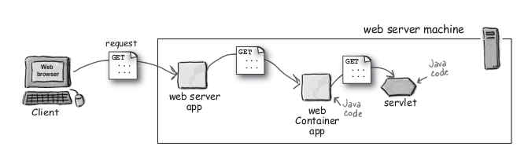
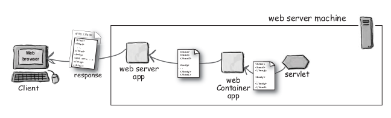
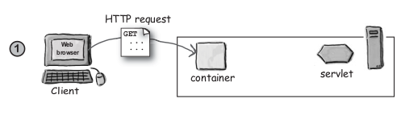
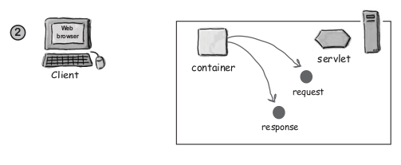
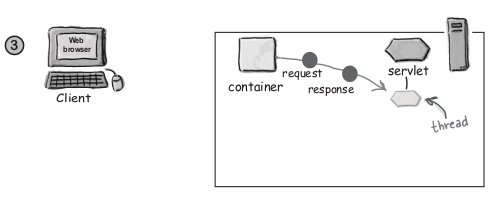
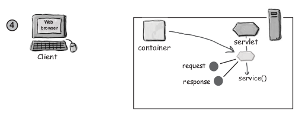
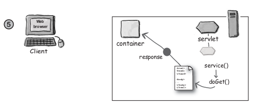
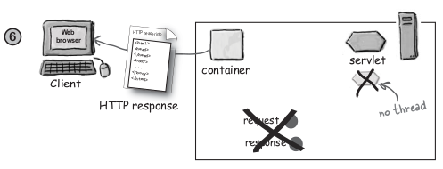
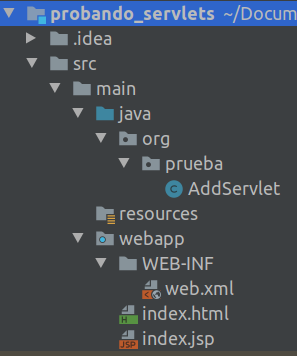

# Java EE. JSP y Servlets

Java Enterprise Edition es un conjunto de tecnologías de Java para la creación de aplicaciones web. Desde su aparición han nacido tecnologías en el ecosistema Java web (Spring, Vaddin, Struts, etc.) que se apoyan en java EE.

Para empezar, vamos a conocer algunos detalles sobre cómo  funciona un servidor web Apache Tomcat.

## Anatomía de una solicitud GET

Las solicitudes HTTP GET son las más simples en el protocolo HTTP. Su tarea principal es solicitar un recurso como un documento HTML, una imagen, un documento PDF, etc. A continuación se muestra un ejemplo de cabecera HTTP.

```
GET /select/selectBeerTaste.jsp?color=dark&taste=malty HTTP/1.1
Host: www.wickedlysmart.com
User-Agent: Mozilla/5.0 (Macintosh; U; PPC Mac OS X Mach-O; en-US; rv:1.4) Gecko/
20030624 Netscape/7.1
Accept: text/xml,application/xml,application/xhtml+xml,text/html;q=0.9,text/
plain;q=0.8,video/x-mng,image/png,image/jpeg,image/gif;q=0.2,*/*;q=0.1
Accept-Language: en-us,en;q=0.5
Accept-Encoding: gzip,deflate
Accept-Charset: ISO-8859-1,utf-8;q=0.7,*;q=0.7
Keep-Alive: 300
Connection: keep-alive
```

## Anatomía de una solicitud POST

Las solicitudes HTTP POST están diseñadas para ser usadas por el navegador para realizar solicitudes complejas al navegador. Cuando un usuario completa un formulario, los datos de éste son enviados al servidor mediante una sección llamada *payload* o carga útil. En el ejemplo siguiente se muestra la cabecera HTTP de una solicitud POST. La carga útil aparece como dos pares de clave valor: *color=dark&taste=malty*

```
POST /advisor/selectBeerTaste.do HTTP/1.1
Host: www.wickedlysmart.com
User-Agent: Mozilla/5.0 (Macintosh; U; PPC Mac OS X Mach-O; en-US; rv:1.4) Gecko/
20030624 Netscape/7.1
Accept: text/xml,application/xml,application/xhtml+xml,text/html;q=0.9,text/
plain;q=0.8,video/x-mng,image/png,image/jpeg,image/gif;q=0.2,*/*;q=0.1
Accept-Language: en-us,en;q=0.5
Accept-Encoding: gzip,deflate
Accept-Charset: ISO-8859-1,utf-8;q=0.7,*;q=0.7
Keep-Alive: 300
Connection: keep-alive

color=dark&taste=malty
```

## Anatomía de una respuesta HTTP

El servidor responde a una solicitud con un paquete HTTP, que incluye en su cabecera información sobre si la solicitud se resolvió exitosamente, y qué tipo de contenido incluye el *payload*.

```
HTTP/1.1 200 OK
Set-Cookie: JSESSIONID=0AAB6C8DE415E2E5F307CF334BFCA0C1; Path=/testEL
Content-Type: text/html
Content-Length: 397
Date: Wed, 19 Nov 2003 03:25:40 GMT
Server: Apache-Coyote/1.1
Connection: close

<html>
...
</html>
```

## POST o GET

Usamos GET salvo cuando deseamos enviar información al servidor debemos usar POST. Vamos algunas situaciones:

- Un usuario se loguea introduciendo usuario y contraseña (POST)
- Un usuario accede a una página a través de un enlace [GET]
- Un usuario selecciona un botón de radio en un formulario y lo envía [POST]

## Cómo funciona Tomcat

Tomcat es un nombre sobrecargado. Por un lado, es un servidor web. Por otro es un contenedor de servlets. Dependiendo del contexto nos referimos a una u otra cosa.

### Tomcat como servidor web.

Como servidor web, Tomcat recibe solicitudes de recursos estáticos (documentos HTML, imágenes, etc.). El servidor encuentra duchos recursos en el directorio de la aplicación web, y los devuelve. 

> Un servidor web no puede gestionar contenido dinámico. Sólo contenido estático.

### Tomcat como contenedor de servlets

Tomcat es, además del nombre de un servidor web, el nombre de un **contenedor web**. Cuando el servidor web recibe una solicitud de contenido dinámico, el servidor gestiona la solicitud a través de un contenedor. Un contenedor web es un componente capaz de ejecutar código Java en el servidor. 

> Un servlet es una clase de Java que hereda de la clase *HttpServlet*.

> Un contenedor web (o contenedor de servlets) es el componente de un servidor web que se encarga de administrar el ciclo de vida de los servlets solicitados.





Cuando Tomcat recibe una solicitud HTTP, el proceso es el siguiente:



paso 1. El usuaro hace clic en un enlace que tiene la url de un servlet (en lugar de una página estática).



paso 2. El contenedor ve que la solicitud es para un servlet. El contenedor crea dos objetos:
- HttpServletResponse (response)
- HttpServletRequest (request)



paso 3. El contenedor encuentra el servlet basándose en la URL. Entonces ejecuta el servlet y  le pasa los objetos *HttpServletResponse* y *HttpServletRequest* al servlet.



paso 4. Al herdedar de la clase *HttpServlet*, un servlet hereda un método llamado *service*. El contenedor ejecuta este método, que decide si la solicitud es de tipo *POST* o *GET*. Dependiendo de ello, el método *service* llama al método *doPost* o *doGet* (que son los métodos que el programador debe implementar.



paso 5. El método *doGet* o *doPost*, escrito por el programador, se ejecuta y genera contenido dinámico, que es devuelto al contenedor.



paso 6. Una vez que la ejecución del servlet concluye, el contenedor convierte el contenido devuelto en una respuesta HTTP, que es enviada de vuelta al cliente. Finalmente borra los objetos *HttpServletRequest* y *HttpServletResponse*.

# Primer ejemplo con servlets

Java EE está orientado al patrón MVC. Esto (a grandes rasgos) quiere decir que separa la capa de presentación, y el modelo de la aplicación mediante un elemento intermedio llamado controlador. Cada una de estas tres partes (Modelo, Vista y Controlador) tiene su sitio:
- La vista se gestiona mediante archivos *JSP*
- El control se lleva a cabo mediante *servlets*
- El modelo contendrá el código con la lógica de negocio de la aplicación, en forma de clases Java normales.

Para conocer qué es un servlet, vamos a escribir un primer proyecto en el que se toma un par de números de un formulario, se suman y se muestra el resultado. Aunque lo normal es que la capa de presentación se implemente en un archivo *.jsp*, y la lógica de negocio esté en un *servlet*, en este primer ejemplo vamos a meter todo (presentación y lógica de negocio) en el servlet (exactamente al revés que hasta ahora, con la lógica de negocio y vista en el archivo *.jsp*).

Los elementos necesarios para este primer ejemplo con jsp y servlets son los siguientes:

1. Una declaración de servlets, mediante el archivo *web.xml*.
2. El servlet propiamente dicho, *AddServlet.java*.
3. Un documento html con el formulario.



### Primer ejemplo con servlets. El documento index.html

En el documento *index.html* habrá el siguiente contenido:

```
<!DOCTYPE html>
<html lang="en">
<head>
    <meta charset="UTF-8">
    <title>Test servlet</title>
</head>
<body>
    <form action="add">
        Insertar un número: <input type="text" name="num1"><br>
        Insertar otro número: <input type="text" name="num2"><br>
        <input type="submit">
    </form>
</body>
</html>
```

En el formulario indicamos en *action* el valor *add*. Cuando el cliente (navegador web) hace una solicitud (una solicitud GET en este caso), el servidor web (Tomcat) comprueba la URL (/add) y determina que el recurso solicitado por el usuario no es una página estática (por ejemplo un .html), de modo que reenvía la solicitud al contenedor web* (Tomcat). Una solicitud HTTP llegará al servidor Apache, que al no encontrar un archivo llamado "add", pasará la solicitud al contenedor, que buscará un servlet llamado así.

La URL del servlet es mapeada mediante el archivo *web.xml*. Este archivo es llamado *deployment descriptor* (o descriptor de despligue) porque describe el servlet desplegado para que el contenedor web pueda encontrarlo. A través del descriptor, el contenedor web determina qué servlet debe ser llamado para atender la solicitud HTTP.

### Primer ejemplo con servlets. El servlet

El código de nuestro primer servlet va a ser como sigue.

```
public class AddServlet extends HttpServlet {
    @Override
    protected void service(HttpServletRequest req, HttpServletResponse resp) throws ServletException, IOException {
        int i = Integer.parseInt(req.getParameter("num1"));
        int j = Integer.parseInt(req.getParameter("num2"));

        int k = i + j;

        PrintWriter out = resp.getWriter();
        out.println("Result is: " + k);
    }
}
```

¡OJO! Para poder extender la clase *HttpServlet* es necesario añadir como dependencia la librería *Java Servlet API*.

*NOTA: Conforme vayamos avanzando, no sobreescribiremos el método *service*, sino que sobreescribiremos los métodos *doPost* y *doGet* y dejaremos que *service* ejecute uno de ellos dependiendo del tipo de si la solicitud HTTP es GET o POST.*

El servlet utiliza parámetro *req* para encapsular la solicitud, y el parámetro *resp* para encapsular la respuesta. Si leiste el apartado *Tomcat como contenedor de servlets*, entenderás que estos dos objetos *req* y *resp* son creados por el contenedor como portadores de la información que llega en la solicitud HTTP y de la información que saldrá como respuesta HTTP.

### Primer ejemplo con servlets. Web.xml

El archivo *web.xml* es también llamado *descriptor de despliegue* o sencillamente DD (*Deployment Descriptor*). El descriptor de despliegue es utilizado por el servidor Tomcat para localizar el servlet asociado a una URL. Es decir, en este archivo mapeamos URLs a Servlets.

Su contenido en este primer ejemplo será el siguiente:

```
<!DOCTYPE web-app PUBLIC
 "-//Sun Microsystems, Inc.//DTD Web Application 2.3//EN"
 "http://java.sun.com/dtd/web-app_2_3.dtd" >

<web-app>
  <display-name>Archetype Created Web Application</display-name>
  <servlet>
    <servlet-name>abc</servlet-name>
    <servlet-class>org.prueba.AddServlet</servlet-class>
  </servlet>
  <servlet-mapping>
    <servlet-name>abc</servlet-name>
    <url-pattern>/add</url-pattern>
  </servlet-mapping>
</web-app>
```

En este archivo, hay que tener en cuenta que:
- El elemento **servlet**: indica el nombre de la clase.
    - **servlet-name:** clave para relacionar con el elemento servlet-mapping. 
    - **servlet-class**: nombre de la clase.
- El elemento **servlet-mapping**: indica la url del servlet.                                      |
    - **servlet-name:** clave para relacionar con el elemento servlet. 
    - **url-pattern:** url asociada al servlet.

Decimos que un servlet tiene 3 nombres diferentes:
- Su URL (url-pattern)
- Su alias (servlet-name)
- El nombre de la clase Java (servlet-class)

Para hablar entre programadores, lo más normal es utilizar el nombre de su alias (servlet-name).

# Anotaciones

A partir de 2011, se puede utilizar en los servlets anotaciones que son equivalentes a los elementos en *web.xml* en concreto, en lugar de utilizar los elementos \<servlet> y \<servlet-mapping>, se puede utilizar la anotación *WebServlet* del siguiente modo:

Lo que en el archivo *web.xml* aparece como:

```
	<servlet>
		<servlet-name>nombreServlet</servlet-name>
		<servlet-class>com.politecnicomalaga.ServletConAnnotation</servlet-class>
	</servlet>
	<servlet-mapping>
		<servlet-name>nombreServlet</servlet-name>
		<url-pattern>/url_servlet</url-pattern>
	</servlet-mapping>

```

En el servlet correspondiente aparece como:

```
@WebServlet(
    name="nombreServlet",
    urlPatterns={"/url_servlet"}
)
public class TheServlet extends HttpServlet {
    // servlet code...
}
```

Se pueden especificar múltiples patrones URL. Lo que en *web.xml* aparecería así:

```
	<servlet-mapping>
		<servlet-name>nombreServlet</servlet-name>
		<url-pattern>/url_servlet</url-pattern>
	</servlet-mapping>
	<servlet-mapping>
		<servlet-name>nombreServlet</servlet-name>
		<url-pattern>/url_servlet2</url-pattern>
	</servlet-mapping>
```
En la anotación *@WebServlet* quedaría:

```
@WebServlet(
    name="nombreServlet",
    urlPatterns={"/url_servlet1","/url_servlet2"}
)
```

# Java EE siguiendo el patrón MVC (estilo tradicional)

Conforme va pasando el tiempo tiende a haber una separación más clara entre el lado cliente y el lado servidor. En el lado cliente hay lenguajes de cliente, como HTML, CSS y javascript. El lado servidor se deja para lenjuajes de servidor, como PHP, Java o Python. Y finalmente ambos extremos se comunican mediante solicitudes AJAX. Pero nosotros vamos a dejar esta estrategia para más adelante.

En este apartado vamos a ver cómo utilizar Java EE para construir una aplicación web siguiendo el modelo MVC original. En este ejercicio vamos crear una aplicación de asesoramiento sobre qué cerveza puedes beber según su color. 

## 1. La clase ExpertoCerveza

En primer lugar tendremos nuestra clase experta en cerveza: *ExpertoCerveza.java*. Esta es una clase POJO (*Plain Old Java Object*) de nuestro modelo. No es diferente a cualquier clase que hayamos escrito ya.

```
package com.politecnicomalaga.modelo;

import java.util.ArrayList;
import java.util.List;

public class ExpertoCerveza {
    public List getMarcas(String color){
        List<String> cervezas = new ArrayList<>();
        switch (color){
            case "clara":
                cervezas.add("San Miguel - Fresca");
                cervezas.add("Estrea Damm - Saaz");
                break;
            case "ambar":
                cervezas.add("Ambar - Especial");
                cervezas.add("Alhambra - Especial");
                cervezas.add("Estrella Damm - Original");
                break;
            case "marron":
                cervezas.add("Estrella Damm - Bock-Damm");
                cervezas.add("Mahou - Maestra");
                break;
            case "negra":
                cervezas.add("Estrella Galicia - 1906 Black Coupage");
                cervezas.add("Alhambra - Baltic Porter");
                break;
            default:
                cervezas.add("No hay sugerencias");
        }
        return cervezas;
    }
}
```
## 2. El servlet

En segundo lugar, necesitamos un servlet. A diferencia del primer ejemplo que pusimos, vamos a utilizar el método *doPost*. Esta es la forma más normal de hacelo, ya que podemos elegir el tipo de solicitud a la que estamos contestando. Implementando *doPost* estamos atendiendo a las solicitudes HTTP de tipo *POST*, con envío de parámetros en el *payload*.

```
package com.politecnicomalaga;

import com.politecnicomalaga.modelo.ExpertoCerveza;

import javax.servlet.RequestDispatcher;
import javax.servlet.ServletException;
import javax.servlet.http.HttpServlet;
import javax.servlet.http.HttpServletRequest;
import javax.servlet.http.HttpServletResponse;
import java.io.IOException;
import java.util.List;

public class SugerenciaCervezaServlet extends HttpServlet {
    @Override
    protected void doPost(HttpServletRequest req, HttpServletResponse resp) throws ServletException, IOException {
        ExpertoCerveza experto = new ExpertoCerveza();
        List<String> recomendaciones = experto.getMarcas(req.getParameter("color"));
        req.setAttribute("lista_cervezas",recomendaciones);
        RequestDispatcher view = req.getRequestDispatcher("resultCerveza.jsp");
        view.forward(req,resp);
    }
}
```
En el código anterior hay varias líneas destacables.

#### i. Obtener un parámetro enviado en la cabecera HTTP

```
    List<String> recomendaciones = experto.getMarcas(req.getParameter("color"));
```
En esta línea se obtiene el valor del parámetro "color" enviado mediante el formulario.

#### ii. Almacenar un atributo en el objeto HttpServletRequest para su posterior uso en la vista

```
    req.setAttribute("lista_cervezas",recomendaciones);
```
En esta línea se crea un atributo llamado *lista_cervezas* para ser usado en la vista. Un atributo es diferente a un parámetro. Los parámetros son recibidos en la solicitud HTTP, mientras que los atributos son objetos creado en el servlet que se pueden usar durante la vida útil del objeto *HttpServletRequest*.

#### iii. Redirigir la consulta a un dispatcher

```
    RequestDispatcher view = req.getRequestDispatcher("resultCerveza.jsp");
    view.forward(req,resp);

```
En el patrón MVC, una de las tareas del controlador es elegir la vista que se mostrará y darle paso. En un *servlet* la elección de la vista se hace mediante el método *getRequestDispatcher*. En la línea mostrada, se elige la vista *resultCerveza.jsp*. Una vez creado el objeto de tipo *RequestDispatcher* (referenciado por la variable *view*) se le da paso mediante el método *forward*.

NOTA: Mediante el método *getRequestDispatcher* se puede indicar un documento html, un archivo JSP u otro servlet.

## 3. El Deployment Descriptor

```
<!DOCTYPE web-app PUBLIC
 "-//Sun Microsystems, Inc.//DTD Web Application 2.3//EN"
 "http://java.sun.com/dtd/web-app_2_3.dtd" >

<web-app>
  <display-name>Archetype Created Web Application</display-name>

  <servlet>
    <servlet-name>servlet cerveza</servlet-name>
    <servlet-class>com.politecnicomalaga.SugerenciaCervezaServlet</servlet-class>
  </servlet>

  <servlet-mapping>
    <servlet-name>servlet cerveza</servlet-name>
    <url-pattern>/opciones.do</url-pattern>
  </servlet-mapping>

</web-app>
```

Lo más destacable del DD son los tres nombre elegidos para el servlet:
- *Nombre de la clase*: SugerenciaCervezServlet
- *Nombre de despliegue*: servlet cerveza
- *Nombre de URL*: opciones.do

## 4. La vista (el archivo JSP)
```
<%@ page import="java.util.*" %>
<%@ page import="java.io.PrintWriter" %>
<%--
  Created by IntelliJ IDEA.
  User: mauri
  Date: 19/4/20
  Time: 23:23
  To change this template use File | Settings | File Templates.
--%>
<%@ page contentType="text/html;charset=UTF-8" language="java" %>
<html>
<head>
    <title>Cervezas</title>
</head>
<body>
    <%
        PrintWriter printer = response.getWriter();
        printer.print("La opción es " + request.getParameter("color"));
        List<String> cervezas = (List) request.getAttribute("lista_cervezas");
        for (String cerveza: cervezas){
            printer.print("<br>prueba " + cerveza);
        }
    %>
</body>
</html>
```

El documento JSP se encarga de presentar el resultado. Internamete el contenedor transforma el archivo JSP en un servlet y lo ejecuta. El código incluye varios elementos a destacar:

- Directiva: una directiva es una forma de dar instrucciones especiales al contenedor para traducir el documento JSP. En el ejemplo aparece la directiva siguiente:
```
<%@ page import="java.util.*" %>
<%@ page import="java.io.PrintWriter" %>
```
Estas directivas indican al contenedor que el servlet resultante importa las clases indicadas.

- Scriptlet: un scriptlet es un fragmento de código Java que debe ser incluido en el servlet resultante de la traducción. Los *scriptlets* están demarcados por las etiquetas *<%* y *%>*.

- PrintWriter: se puede obtener un objeto de clase *PrintWriter* del objeto *HttpServletResponse*. En un documento JSP, el objeto *HttpServletResponse* está predefinido con el nombre *response*. Un objeto *PrintWriter* se utiliza para escribir contenido de texto HTML u otro tipo de contenido en el objeto *response*. Si leiste el apartado "*Tomcat como contenedor de servlets*", sabrás que una vez que la consulta ha terminado, el contenedor extrae el contenido de *response* y lo envía de vuelta al navegador.


## 5. La página html con el formulario

```
<!DOCTYPE html>
<html lang="en">
<head>
    <meta charset="UTF-8">
    <title>Sugerencia</title>
</head>
<body>
<html><body>
<h1 align="center">Beer Selection Page</h1>
<form method="POST" action="opciones.do">
    Select beer characteristics<p>
    Color:
    <select name="color">
        <option value="clara">Clara</option>
        <option value="ambar">Ámbar</option>
        <option value="marron">Marrón</option>
        <option value="negra">Negra</option>
    </select>
    <br><br>
    <input type="submit">
</form>

</body>
</html>
```

En este archivo hay dos cuestiones destables por encima de las demás:
- El valor del parámetro *action* del formulario (*opciones.do*) se corresponde con el *nombre de URL* del servlet.
- El método de envío del formulario es *POST*. Esto es importante tenerlo en cuenta, porque el servlet implementa el método *doPost*, es decir, que espera una consulta de tipo *POST*. Si indicamos en el formulario que el método es *GET*, el servlet no sabrá como gestionar la consulta.

## Apéndice: Peticiones GET con parámetros

Si la solicitud es enviada mediante el método *GET*, los parámetros van en la URL, en tal caso el código necesario para resolver el mismo problema de la cerveza, es el siguiente:

### El formulario (cambia el método de envío)

```
<!DOCTYPE html>
<html lang="en">
<head>
    <meta charset="UTF-8">
    <title>Sugerencia</title>
</head>
<body>
<html><body>
<h1 align="center">Beer Selection Page</h1>
<form method="GET" action="opciones.do">
    Select beer characteristics<p>
    Color:
    <select name="color">
        <option value="clara">Clara</option>
        <option value="ambar">Ámbar</option>
        <option value="marron">Marrón</option>
        <option value="negra">Negra</option>
    </select>
    <br><br>
    <input type="submit">
</form>

</body>
</html>
```

### El servlet (cambia el método ejecutado por *service* a *doGet*)

```
public class SugerenciaCervezaServlet extends HttpServlet {
     @Override
    protected void doGet(HttpServletRequest req, HttpServletResponse resp) throws ServletException, IOException {
        ExpertoCerveza experto = new ExpertoCerveza();
        List<String> recomendaciones = experto.getMarcas(req.getParameter("color"));
        req.setAttribute("lista_cervezas",recomendaciones);
        RequestDispatcher view = req.getRequestDispatcher("resultCerveza.jsp");
        view.forward(req,resp);
    }
}
```
--------------------------------

**Actividad 1.** Prueba a desplegar el ejercicio anterior en tu servidor Tomcat y haz funcionar el proyecto. A continuación tienes unas capturas de su ejecución.

**Actividad 2.** Crea un proyecto que calcule el enésimo término de la serie de Fibonacci. El proyecto incluirá los siguientes elementos:
- Un documento HTML con un formulario que admite un número. Este número representa el enésimo término de la serie, y es enviado mediente el método POST a un servlet.
- Un servlet, cuyo nombre de despliegue es *fibonacci*. 
- Una clase llamada *Fibonacci* que calcula el enésimo término de la serie.
- Un documento JSP que muestra el resultado en forma de documento HTML.

Elige cómo quieres declarar el servlet, mediante el DD, o bien mediante anotaciones.

